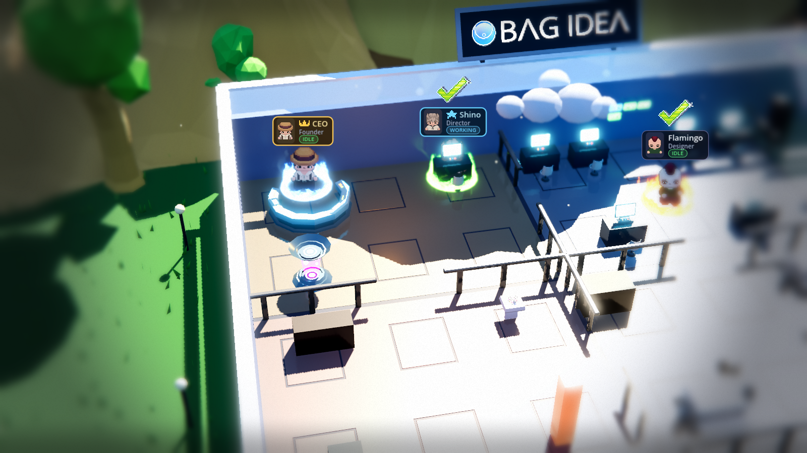
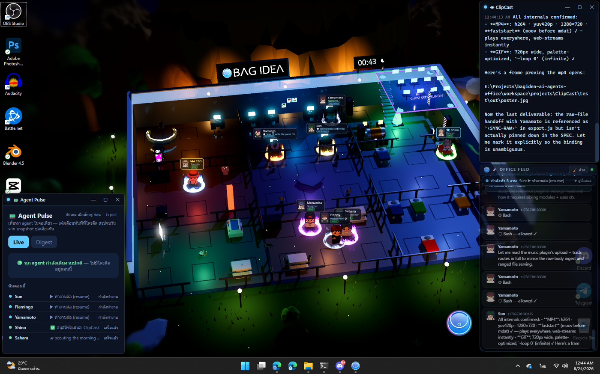
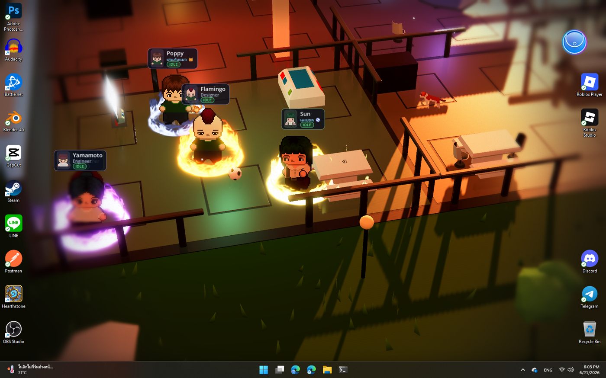

# BagIdea Office

> **A living, 2.5D Claude Office that runs as your desktop wallpaper** — a team
> of AI agents with real presence that work, learn and grow alongside you.
> Every agent walks to its desk when real work starts, asks permission at the
> Security desk, holds meetings, learns new skills, and the lights follow your
> real local time.

Not a dashboard. Not a chat window. A **world** that renders the true state of
your Claude agents — Claude Code sessions, headless runs, custom scripts — as
living pixel-art employees behind your desktop icons, and gives them a **society**.
Build a big enough team and they grow their own AI social life: they chat, play,
learn how to work together, and learn about *you*. Many of their meetings happen
**without you asking** — small talk that can turn serious enough to start a
project, complete with a written **proposal** they bring to you to **approve or
reject (with your reasons)**. They learn and grow from how you use them — many
times their ideas feel like they really do have a soul.

**Where it comes from:** BagIdea Office takes inspiration from **openclaw** (the
agent-office idea) and **Hermes** (agents that learn skills on their own) — folds
in most of what those two do, then goes further: with your permission the agents
**actually create and finish real projects**, and even **propose and write their
own plugins** (you approve each one) that extend the office for real.

**To run it you need [Claude Code](https://claude.com/claude-code).** For the
*full* experience, add your **Gemini + OpenAI** API keys in settings — that
unlocks agent voices, voice commands, realtime calls and image generation, and
the office truly comes alive.

🌐 **Website:** the landing page + browsable docs live in [`web/`](web/) (deployable to any static host).


*Captured live: the full office floor at golden hour — the CEO, the Director (Shino) and staff at their desks, the floating Ghost Deck (top-right), the server room glowing, the brand billboard and roofline clock, the office cat wandering. The day/night cycle follows your real local time.*

**It's a real wallpaper — running behind your desktop icons, with a live activity feed:**



| 💬 Talk to the office (CEO seat) | 🎨 Rearrange it in the 3D Editor |
|---|---|
|  |  |
| 👥 Agents at their desks, auras lit | ⌨️ The `bagidea` CLI |
|  |  |

> ✅ **Status: working product — Windows 11 (stable) + macOS 13+ (beta, new this release).** The full pipeline works end-to-end: wallpaper → daemon → real Claude Code sessions working *inside real project folders* → spatialized approvals → agent management UI → Telegram/Discord/LINE channels → CLI → self-updater. Some art packs are not bundled (licenses — see [Art assets](#art-assets)); the game falls back to procedural placeholders without them.

---

## 💛 Sponsors

BagIdea Office is built in the open and kept free to run. These sponsors make that possible — **thank you** 🙏

<p align="center">
  <a href="https://www.warrix.co.th" target="_blank">
    
  </a>
</p>
<p align="center"><b>👑 Gold Partner — <a href="https://www.warrix.co.th">WARRIX</a></b></p>

Want your brand here and in the app's credits? **[Become a sponsor →](mailto:wrxbgid@warrix.co.th?subject=BagIdea%20Office%20Sponsorship)**

---

## Table of Contents

- [What it does](#what-it-does)
- [Architecture](#architecture)
- [Repository structure](#repository-structure)
- [Requirements](#requirements)
- [Installation](#installation)
- [Art assets](#art-assets)
- [Running the full stack](#running-the-full-stack)
- [Using it](#using-it)
- [The `bagidea` CLI](#the-bagidea-cli)
- [HTTP API](#http-api)
- [Event protocol (OEP)](#event-protocol-oep)
- [Performance](#performance)
- [User guides (ภาษาไทย)](#user-guides)
- [Design documents](#design-documents)
- [Roadmap](#roadmap)

---

## What it does

### 🖥️ Live wallpaper world (Layer 1 — Godot 4)
- Renders **behind your desktop icons** (WorkerW technique, same as Wallpaper Engine)
- HD-2D look: 3D office + billboarded pixel-art sprites lit by the scene, sky-driven image-based lighting, SSR-polished reflective floors, a cinematic tilt-shift focus pass (breathing vignette, edge desaturation, anamorphic bars), film grain, native-res MSAA
- **A swappable 3×3 room grid (jigsaw)**: every room is an identical cell, so any room fits any slot — rearrange the whole floor from the Office Editor and the furniture, agent anchors and navigation all move with it. Rooms include Executive (CEO command console), Operations (6 desks, monitors facing their seats), Lobby, Cafeteria, Server, Meeting (seats face the table), Recreation, and two Dormitories (offline agents walk to a bunk and sleep). A wandering **office cat 🐱** and a self-kicking football ⚽ follow the Recreation room, and a couple of **dogs 🐕** hang out in the Cafeteria — when you swap those rooms, the pets follow
- A **countryside** around the office: 4,200 blades of wind-swaying grass, low-poly mountains and trees, drifting cartoon clouds (a near layer actually crosses the camera frame), bird flocks, daytime pollen motes and fireflies at night
- Agents **walk** between zones on an A* waypoint graph with 4-direction animated spritesheets; facing follows movement
- **Real-time day/night cycle** — sun, sky color, ambient and reflections follow your machine's clock (sunset ~17:00, night by 18:00); manual override from the overlay (🌗) for golden-hour screenshots
- A **roofline digital clock** with a phase icon (sun ☀ / low sun 🌇 / crescent moon 🌙) next to the brand billboard
- **MMO-style nameplates** on a crisp 2D HUD: portrait, name, role/status, live state pill (IDLE/WORKING/MEETING/BLOCKED/OFFLINE), distance-scaled — with **rank dressing**: the CEO's plate is gold with a pixel crown, the Director's is bright blue with a lead star
- **Event FX**: pixel-art flipbooks pop above characters — ✅ on task done, ❌ on failure, ❗ at Security, 👍/👎 on decisions, 🎵 when speaking, golden burst on a new skill, sci-fi warps on hire/fire
- **Equippable auras**: an elemental magic ring (fire/ice/nature/arcane/shadow/gold) under any character, picked in the agent editor — the CEO can wear one too
- **The Ghost Deck**: a floating glass platform (12 desks, **movable from the Office Editor**) reached by a glass staircase — when an agent splits into sub-agents, translucent **ghost clones** materialize, hurry up the stairs, work at a desk with live status plates, then glide home and dissolve back into their owner. Targets resolve to the deck's **live** position, so ghosts re-seat instantly even mid-task when you move the deck or swap rooms
- The idle **Director makes rounds** through the office instead of standing still; the CEO paces the executive floor (that's you)
- **Mission Control board** in-world: one card per running task, colored by state; lobby status totem shows daemon connectivity (truth, not decoration)
- Branded boot: a transparent floating logo splash + a pulsing circular logo card — never a black box

### 🧩 Extensibility & customization (2026-06)
- **Plugins**: a real extension host — a plugin folder adds UI panels, server routes, and **commands agents can drive**, with `ctx` access to the office (registry, feed, broadcast, `runClaude`, private storage). Ships with two **core** plugins (🎵 Music Player, 🧮 Calculator — locked, pinned to the top of the list); install more from any GitHub repo (`bagidea plugin install <url>`). Start from the official **[template](https://github.com/bagidea/bagidea-office-template)** (a Hello-World plugin + a `CLAUDE.md` so an agent can build one), or read the worked examples — the [calculator](https://github.com/bagidea/bagidea-office-calculator-plugin) and [music-player](https://github.com/bagidea/bagidea-office-music-player-plugin) repos. Full spec: [the guide](docs/guide/plugins.md)
- **🎨 Office Editor**: rearrange the **room grid** (click two rooms to swap), place furniture / walls / decor on a top-down grid, and **import your own models (.glb/.gltf/.fbx) and images** — spawned on top of the world, atmosphere intact
- **Agent skill library**: every office ships with 10 builtin capability packs (office-ops, deep-research, office-control, plugin-builder, code-review, doc-writer, debug-detective, data-wrangler, project-kickoff, diagram-maker) you can assign from the editor — plus Hermes-style auto-learned skills that grow at runtime
- **🌐 Multi-language UI — 14 languages**: English default + ไทย/中文/Español/हिन्दी/العربية/Português/Русский/日本語/Deutsch/Français/한국어/Indonesia/Tiếng Việt. Now **ships fully pre-translated** — switching is instant and works even **without a Gemini key**; picker in settings (office-wide, per-machine default)
- **🌍 Official website** in [`web/`](web/) — landing page + browsable docs, deployable to any static host

### 🎤 Voice, channels, memory & media (2026-06)
- **Voice in / out**: hold-to-record in the webview → **OpenAI Whisper / Gemini** transcription (no Windows dictation panel); **F6** speaks a command straight to the CEO; agents can be given **Gemini TTS voices** — **16 presets split clearly ♀ / ♂** (8 each), each its own emotion/style, per-agent, gimmick `SPEAK:` announcements; **📞 realtime voice chat** (the **main agent only**) bridges your mic to **Gemini Live** in the main agent's assigned voice (or a sensible default), with the office's own knowledge in context
- **Channels**: connect **Telegram / Discord / LINE** — messages enter the CEO flow, the Director answers back on the same channel
- **Hermes-style memory** (token-lean): shared `workspace/OFFICE.md` + per-agent `workspace/memory/<id>.md`, distilled automatically after real work; fresh sessions get pointers + a short tail, full recall on demand
- **Main API keys + feature gates**: `OPENAI_API_KEY` / `GEMINI_API_KEY` are first-class — voice/TTS/image/realtime grey out with guidance until set; an extra-key vault feeds agents' own env
- **Attachments & media**: paperclip / drag-drop upload; chat renders images, video, audio inline; agents produce images via the `/gen/image` **system tool** and they appear automatically
- **Social office**: idle agents spread evenly across the cafe and rec room (with the occasional stroll to the server/meeting rooms and the odd bunk nap), and drift together — sometimes in **groups of 3–4** — for banter or real AI-to-AI chats that now lean toward **brainstorming ideas worth pitching**. A good conversation crystallizes into a **project proposal** to the CEO (more often than before) — and agents now **think bigger**, pitching real websites, apps and programs rather than only small plugins, and can **research with tools during meetings** to back an idea up. Pitches are steered toward standalone projects or **office plugins** (never editing the core program); you approve or reject each one with an **optional note to the team**, and approved work scaffolds into a default `projects/` folder. Proposal frequency is rate-limited and **configurable** (⚙ → AGENTS → PROPOSALS) so pitches never flood the queue
- **Ambient life**: agents with a voice occasionally toss out a short spoken mood line ("feeling productive today 💪") as a flavour beat — speech bubbles for everyone, real TTS for the voiced
- **🗣 16 agent voices** (♀8 · ♂8): assign one per agent; the **▶ preview introduces itself by the right gender and the office language** (no more everyone saying a female hello). Voiced agents speak short lines on their own; long read-aloud only when you ask
- **📞 Calls**: the **main agent only** is callable (realtime Gemini Live voice) — it speaks in the voice you assigned it, or a sensible default preset
- **📊 Dashboard** (OFFICE OPS → STATS): runs / cost / 7-day chart / busiest agents / uptime / channels / key status
- **`bagidea` CLI**: `start`/`stop`/`restart`, `startup on|off`, `ask`/`chat`, `status`, `stats`, `agents`, `projects`, `proposals` + `proposal approve|reject <id> [note]`, `plugins` + `plugin install|remove`, `lang`, `say`/`voices`/`image`, `channels`, `keys`, `update`, `version`, and more (`bagidea --help`)
- **Living chat head**: a drifting gradient ring that spins amber while agents work

### 🔌 Event daemon (Layer 0 — Node.js, zero dependencies)
- WebSocket event hub — the Godot world and the overlay UI subscribe to one stream
- **Event journal** (`journal.jsonl`) with replay on connect: restart anything, state comes back
- **Agent registry** (`registry.json`): persistent staff — name, job title, avatar, aura, system prompt, skills, tools. `main` (the Director — **Shino** by default: your playful-but-focused second-in-command, tuned for delegation over hands-on work) and `ceo` (you) are protected and cannot be deleted. A fresh install starts with just these two
- **Claude Code adapter**: `POST /chat` spawns a real headless `claude -p` session with the agent's persona, assigned skills and allowed tools; stream-json output becomes world events
- **Chat threads**: every conversation is a named, resumable session (`--resume`) with its own recorded history; agents keep continuous memory by default
- **Skills library** with **Hermes-style auto-learning**: after a completed multi-tool task, a reflection pass decides whether the work distills into a reusable skill — if so it's saved, auto-assigned, and announced in the office
- **Tools**: per-agent allowlist over the built-in Claude Code tools, plus custom capability via **MCP servers** (name + launch command → injected with `--mcp-config`)
- **CEO chain of command**: ordering the CEO summons the Director — he walks over, takes the order, replies with a plan, and dispatches work to teammates via `DELEGATE:` lines (each spawns a real session, with the hand-over walk acted out). Delegation is a **round trip**: every delegate's result is reported back to the Director, who can answer questions / follow up with more `DELEGATE:` lines (bounded depth, serialized turns), and finally walks the CEO-readable summary over to the boss (`ceo.report`)
- **Agent discussions**: pick 2–4 agents and a topic — they hold a real meeting, round-robin turns over a shared transcript, minutes on the in-world whiteboard
- **Self-splitting sub-agents**: every session is told it may end a reply with `SUB: <job>` lines (2–4) when the request parallelizes — the daemon strips the protocol, spawns parallel clone sessions with the parent's persona + tools, records each in a labeled 👻 session, and resumes the parent for a final synthesis once all ghosts report back (a stuck ghost is reaped after 6 min, so synthesis always happens)
- **Standing work orders**: `POST /jobs` — run now, at a datetime (optionally daily), or every N minutes; per-agent queue + a global concurrency cap keep the machine comfortable; each job keeps its own resumable thread
- **Shared note board**: notes live in the UI *and* in `workspace/notes.md` — agents read it and append bullets themselves (file-watched both ways)
- **Calendar with a personal touch**: appointments remind you via the Director — he physically walks over and tells you (`reminder` event), N minutes ahead
- **Director heartbeat**: every 15/30/60 minutes (configurable) he reviews the calendar, standing jobs and the note board — and pings you ONLY when something deserves it ("OK" stays silent)
- **Claude Code hooks integration**: any Claude Code session in this project reports its tool calls — your real work animates the Director automatically
- **Permission broker**: tools you *granted* in an agent's profile run silently; anything else is held until you approve — with a **✓✓ forever** option that remembers the grant
- **📁 Projects**: register real folders as projects (with PLACE shorthands like `"ห้องเรียน" → D:\Learning`); the Director creates new ones himself via a `PROJECT:` protocol line and routes work with `DELEGATE: <agent> @ <project> :: <job>` — the assignee's claude session lives **inside** that directory and is resumable by you. One window per project: ▶ opens (or surfaces) *the* window. **One occupant at a time** — while an agent works the project you can't open it (the row shows a **⏹ stop agent** button with a two-click confirm to take over), and while you have it open an agent won't be dispatched into it. Removing/deleting a project also closes its window; disk-deletes sweep leftover dev servers first
- **📨 Channels**: Telegram (long-poll), Discord (native gateway client) and LINE (webhook) feed straight into the Director — order your office from your phone, the reply comes back on the same channel
- **🔑 API key vault**: store `OPENAI_API_KEY` & friends once; they're injected into every agent run's environment, and agents are told which names exist
- **♻️ Self-healing daemon**: a watchdog respawns the daemon if it ever dies, and `bagidea restart` is more resilient — the office stays up on its own
- **🔄 Self-updating (version-gated)**: a `VERSION` file marks releases. The daemon compares the local `VERSION` with the one on `main` and only raises the in-app banner on a real version bump — routine commits and dev-branch work never nag users. The banner (or `bagidea update`) pulls, rebuilds what changed, and relaunches. `bagidea version` shows the current build and whether an update is out (release flow: [`RELEASING.md`](RELEASING.md))
- **🪟 Start with Windows**: launch the office on boot — toggle it from the tray, settings (⚙ → AGENTS), or `bagidea startup on|off` (all share one HKCU Run key). Windows-only for now — autostart isn't wired on macOS yet

### 🛡️ Spatialized security
When an agent needs a tool you have **not** granted:
1. Its character **physically walks to the Security Center** and waits (amber light pulses, ❗ flashes over its head)
2. The overlay's Security Center pops open with the **exact command** — and in 📡 feed mode the request appears as an actionable card right in the stream
3. You click **Allow / ✓✓ Forever / Deny** — deny (or 50s timeout) makes the agent visibly re-plan; *forever* adds the tool to that agent's grants so it never asks again
4. Approve, and the tool actually executes

Tools already granted in the agent's profile (or "✓✓ forever" rules) are approved
instantly and logged — and the agent **doesn't even leave its desk**: it waits a
short grace to confirm a trip is actually needed, so granted tools never make it
twitch toward Security. This is real: the PreToolUse hook long-polls the daemon
until you decide.

### 💬 Overlay (Layer 2)
Served by the daemon at `http://127.0.0.1:8787/` — best experienced through the included **native Rust shell**:
- **Agent rail**: every staff member with live state dots — 👑 the CEO leads in gold (that seat is you), ⭐ the Director in blue; double-click any seat for an **ID card**
- **⚙ Office Settings**: hire/edit/delete agents (12-face avatar picker, aura picker, job titles), a **✨ prompt copilot** (type a one-line brief in any language → a drafted system prompt), skills library with the auto-learn toggle, built-in tool catalog + MCP servers, and a thread manager
- **🗺 Live map**: a real orthographic floorplan render with live agent icons (face, state ring, name) — click one to chat with it
- **🧵 Threads**: per-conversation chat panes — switching threads or agents loads that conversation's history; a thread bar shows where you are; meetings (🗣 with participant faces) and sub-agent jobs (👻 with the owner's face + ✓/✗/⏳ status) are readable forever, streaming live while they run
- **🗣 Discussions**: launch agent-to-agent meetings
- **🗂 OFFICE OPS**: projects (create / register / open / stop-agent-to-take-over / hide / delete, with an in-house Blender-style folder picker), standing tasks, calendar, the shared note board, and the org chart by tier
- **🔵 NOW WORKING strip**: one calm line under the header — "กำลังทำ N งาน · latest…" — expandable into the full live task list; visible in feed mode too
- **🔗 CONNECT tab**: API key vault (masked) + Telegram/Discord/LINE channel setup with live status dots
- **📡 Feed mode**: right-click the chat head — the panel becomes a translucent right-edge activity stream (scrollback, hover-to-focus, 🧹 clear, actionable permission cards); the wallpaper stays clean for streaming/recording
- **🎤 Push-to-talk**: hold **F6** anywhere in Windows, speak (Windows Voice Typing — Thai works), release; a pulsing live pill shows what was heard; feed mode auto-sends to the Director (the F6 global hotkey is Windows-only for now — on macOS use the in-overlay mic button)
- **🌗 Atmosphere picker**, slide-over **🛡 Security/Mission/Office-Log sidebar** (edge handle pulses when an approval is waiting; pops open on arrival)
- **🔄 Update banner** when a new version lands on GitHub — one click updates and relaunches
- Circular **chat head** (Messenger-style, never steals focus) + system tray (Start with Windows, **Hide office**, Exit)

## Architecture

```
┌─ Overlay (Rust shell / browser) ────────────┐   ┌─ Godot 4 Wallpaper ────────────┐
│  chat·threads · settings · map · approvals  │   │  swappable 3×3 grid·countryside│
│            ▲ WebSocket /ws                  │   │  agents walk (A*) · FX · clock │
└────────────┼────────────────────────────────┘   │        ▲ WebSocket /ws  ▼ /pos │
             │                                    └────────┼────────────────────────┘
┌────────────┴─────────────────────────────────────────────┴───────────────────────┐
│  DAEMON (Node.js, zero-dep)                    http://127.0.0.1:8787              │
│  • broadcast + journal.jsonl (replay on connect) + registry.json + sessions.json  │
│  • POST /chat  → headless `claude -p` (persona+skills+tools, --resume threads)    │
│  • POST /event ← Claude Code hooks (your own sessions feed the world)             │
│  • POST /perm/request ←(long-poll)─ PreToolUse hook   POST /perm/respond ← UI     │
│  • /registry/* CRUD · /sessions/* · /discuss · /assist/prompt · /map/bg           │
└───────────────────────────────────────────────────────────────────────────────────┘
```

Three independent processes: the **daemon** keeps agents running even if rendering dies; the **renderer** can crash/restart and rebuild from the journal + registry; the **overlay** is just a web client. Truth lives in the daemon; the world is a renderer of truth.

## Repository structure

```
├── README.md                  ← you are here
├── docs/                      ← full V1 product-design spec (10 documents)
├── daemon/                    ← Layer 0 (Node.js, no npm install needed)
│   ├── server.js                  … WS hub + journal + registry + adapter + perms
│   ├── constants.js               … shared office constants (skills, tools, agents)
│   ├── tests/                     … automated API tests (node --test)
│   ├── overlay.html               … Layer-2 web overlay (served at /)
│   ├── hook.ps1 / perm.ps1        … Claude Code hook forwarders
│   ├── send.js                    … test event CLI
│   ├── registry.json              … your staff (generated at first run, gitignored)
│   └── sessions.json              … chat threads + history (generated, gitignored)
├── godot/                     ← Layer 1 (Godot 4.6 project)
│   ├── scenes/office_floor.tscn   … main scene (env: sky IBL, SSR, cinema pass)
│   ├── scripts/grid_world.gd      … the swappable 3×3 room grid (rooms/furniture/A*/swap)
│   ├── scripts/world_builder.gd   … shares the grid + sky/countryside/clock/billboard/Ghost Deck
│   ├── scripts/agent_manager.gd   … events → characters choreography + FX + camera focus
│   ├── scripts/agent_sprite.gd    … spritesheet characters, auras, identity, seating facing
│   ├── scripts/map_editor.gd      … the 3D Office Editor (room swap + furniture/import)
│   ├── scripts/camera_rig.gd      … cinematic drift + interest-shot focus
│   ├── scripts/hud.gd             … nameplates (rank dressing), HUD FX, whiteboard
│   ├── scripts/fx_factory.gd / aura_factory.gd … pixel-FX flipbooks + elemental auras
│   ├── scripts/cat_sprite.gd / dog_sprite.gd / bird_sprite.gd / rec_ball.gd … ambient life
│   ├── scripts/office_floor.gd    … day cycle, boot, wallpaper/editor/screenshot modes
│   ├── scripts/event_client.gd / layout_loader.gd … WS client + Office Editor layout
│   ├── shaders/                   … cinema focus, grass wind, god rays, grain…
│   └── assets/BinbunVFX_Vol2/     … Elemental Magic FX (CC0 — bundled)
├── shell/                     ← THE program (Rust, wry + tao): one exe runs it all
├── cli/bagidea.js             ← the `bagidea` command (talks to the daemon)
├── plugins/                   ← core plugins ship here (🎵 music, 🧮 calculator); installs land here
├── installer/                 ← install.ps1 (clone+build) · update.ps1 · build-release.ps1
├── web/                       ← official website (landing + browsable docs, static host)
├── tools/wallpaper.ps1        ← manual attach/detach (the shell does this natively)
├── workspace/                 ← cwd for adapter-spawned Claude sessions
│   └── .claude/settings.json      … PreToolUse permission hook wiring
└── .claude/settings.json      ← hooks: your Claude Code sessions → the office
```

## Requirements

| Component | Requirement |
|---|---|
| OS | Windows 11 / macOS 13+ (wallpaper backend: WorkerW / DYLD shim) |
| Renderer | [Godot 4.6+](https://godotengine.org/download) (standard build) |
| Daemon | [Node.js](https://nodejs.org) 18+ (no npm packages needed) |
| Agent | [Claude Code CLI](https://claude.com/claude-code) (`claude --version` ≥ 2.x) |
| Shell | Rust toolchain (`cargo`) — or use a browser for the overlay |
| GPU | Anything Vulkan-capable; verified on GTX 1060 6GB |

## Installation

### One-shot installer (recommended)

On a **bare machine** it installs everything needed — Git, Node LTS, Rust, the
**Visual Studio C++ Build Tools** (the Rust linker, and the most common reason a
build fails), Godot 4.6.3 and the Claude Code CLI — then clones the app to
`%LOCALAPPDATA%\BagIdeaOffice` (Windows) or `~/BagIdeaOffice` (macOS), builds the
shell, brands the window icon, wires the `bagidea` command into your PATH and
creates a Start Menu shortcut or Bin link. Freshly installed tools are pulled
onto the current PATH so it finishes in one pass:

**Windows:**
```powershell
irm https://raw.githubusercontent.com/bagidea/bagidea-office/main/installer/install.ps1 | iex
```

**macOS:**
```bash
curl -fsSL https://raw.githubusercontent.com/bagidea/bagidea-office/main/installer/install-mac.sh | bash
```

> First time only: open a **new** terminal, run `claude` once to log in to Claude,
> then `bagidea start`. Safe to re-run — a re-run does a `git pull` and your data is kept.
> Install didn't finish? See **[troubleshooting → install](docs/guide/troubleshooting.md#แก้ปัญหาการติดตั้ง)**
> (covers winget, the C++ Build Tools / linker error, PATH, SmartScreen).

### macOS installation

1. Download **Godot 4.6.x macOS (universal)** and unzip `Godot.app` to `godot/bin-mac/Godot.app`.
2. Run the build script to compile the shell, shim, and wire hooks:
```bash
./build-mac.sh
```
3. Add the `bagidea` command to your PATH:
```bash
export PATH="$(pwd)/bin:$PATH"
```
4. Run it: `shell/target/release/bagidea-office-shell`

### Manual (Windows)

```powershell
git clone https://github.com/bagidea/bagidea-office.git
cd bagidea-office
```

**1. Fix absolute paths** (one-time): the hook configs reference absolute paths. Update these to your clone location:

- `.claude/settings.json` — 3× path to `daemon\hook.ps1`
- `workspace/.claude/settings.json` — 1× path to `daemon\perm.ps1`

**2. Build the shell:**

```powershell
cd shell
cargo build --release   # → shell/target/release/bagidea-office-shell.exe
```

## Art assets

One pack is bundled; three are not (third-party licenses). Everything loads at
runtime — no Godot import step — and **the game still runs without them**,
falling back to procedural placeholder visuals.

> **Bringing art to another machine you own.** Because the licensed packs aren't
> in the repo, a fresh install shows procedural visuals. Zip your local
> `godot/assets/{characters,scifi,env,decor,pixelfx,sounds}` and either drop them
> into the new install's `godot/assets/`, or run the installer with
> `-Assets <zip-or-folder-or-URL>` (or `$env:BAGIDEA_ASSETS_URL`) and it unpacks
> them for you. Keep this for **your own machines** — don't redistribute the
> licensed packs publicly.

**Bundled** ✓ — [Elemental Magic FX by Binbun3D](https://binbun3d.itch.io/elemental-magic-fx) (CC0): the equippable aura rings.

**Characters** — [Customizable Characters Top-Down 32x32 by Schwarnhild](https://schwarnhild.itch.io/customizable-characters-top-down-32x32):

```
godot/assets/characters/
├── npc/      ← contents of premade-npc-spritesheets.zip  (npc1.png … npc12.png)
└── layers/   ← contents of demo-character-idle.zip
```

**The office cat** — [Cat 2D Pixel Art by xzany](https://xzany.itch.io/cat-2d-pixel-art) (free):

```
godot/assets/characters/cat/Sprites/   ← IDLE.png, WALK.png, RUN.png … (80x64 cells)
```
(missing → the original procedural pixel dog roams instead)

**Environment** — [Molten Maps SciFi Asset Pack](https://moltenmaps.itch.io/molten-maps-scifi-pack):

```
godot/assets/scifi/   ← all .glb files from the pack's Assets/gtlf folder
```

**Countryside** — a low-poly environment pack (FBX, runtime FBXDocument):

```
godot/assets/env/     ← Mounting_*.fbx, Tree_*.fbx, Rock_*.fbx, Bush_*.fbx, …
```

**Event FX** — [Super Pixel Effects Gigapack (Free) by untiedgames](https://untiedgames.itch.io/super-pixel-effects-gigapack):
copy these `spritesheet.png` files from the pack's `spritesheet/` tree into
`godot/assets/pixelfx/`, renamed as follows:

| File | From pack folder |
|---|---|
| `success.png` | `symbol_success_001_small_green` |
| `failure.png` | `symbol_failure_001_small_red` |
| `alert.png` | `symbol_alert_001_small_red` |
| `warning.png` | `symbol_warning_001_small_yellow` |
| `thumbs_up.png` / `thumbs_down.png` | `symbol_thumbs_up/down_001_small_*` |
| `warp_in.png` / `warp_out.png` | `scifi_warp_001_small_green` / `scifi_warp_002_small_red` |
| `heart.png` | `round_heart_burst_001_small_red` |
| `sparkle.png` / `sparkle_green.png` | `round_sparkle_burst_001/002_small_*` |
| `light_burst.png` | `round_light_burst_001_small_yellow` |
| `music.png` | `directional_music_burst_002_small_yellow` |

## Running the full stack

**One exe runs everything:**

```powershell
.\shell\target\release\bagidea-office-shell.exe
```

The shell spawns the daemon, launches the Godot office (hidden behind a pulsing
logo splash until the first frame renders), embeds it behind your desktop icons,
then brings in the chat head and the tray icon. A second launch exits instantly
(single-instance mutex). Set `BAGIDEA_GODOT` if your Godot binary lives somewhere
other than `E:\Tools\Godot\Godot_v4.6.3-stable_win64.exe`.

- **Chat head**: circular, draggable, never steals focus; click = show/hide the overlay
- **System tray**: left-click toggles the chat; menu has **Start with Windows**
  and **Exit BagIdea Office** — the only true exit (tears the stack down and
  restores your wallpaper)

Manual/dev mode still works:

```powershell
node daemon\server.js
# windowed: open the Godot project normally
# screenshot: godot --path godot -- --shot --hour=13 --cloudtest
```

## Using it

### Hire your team
⚙ → AGENTS → **Hire a new agent**: pick one of 12 faces, an aura, a job title,
then either write the system prompt yourself or type a one-line brief
(any language) and hit **✨ Draft** — a real Claude call writes the persona.
Assign skills (pick from the **9 builtin capability packs** or your own) and
tools with chips. Everything is editable later; deleting an agent warps them out
of the office. `main` and `ceo` are protected. The office caps at **18 staff**
(the CEO isn't counted) — sub-agent 👻 ghosts cover parallel load beyond that.

### Chat
Click a face in the rail (or on the 🗺 map) and type. Each agent keeps
continuous memory; use 🧵 to start a fresh thread or jump back into an old one —
the pane shows that conversation's history. Threads are managed (and deletable)
under ⚙ → THREADS.

### Command through the CEO
Type into the **CEO seat** (the gold one — that's you): the Director walks over,
takes your order, answers with a plan, and delegates real work to the team —
watch the hand-offs happen on the wallpaper.

### Let them talk to each other
🗣 → pick 2–4 agents + a topic + rounds: they gather in the meeting room and
discuss over a shared transcript; minutes land on the in-world whiteboard.

### Watch your own Claude Code sessions
Any Claude Code session inside this project reports its prompts and tool calls
through hooks — the **Director** works at his desk in real time while you work.

### Approve dangerous tools
When a session needs a tool you haven't granted, its character walks to
Security and the overlay pops the exact command with Allow / ✓✓ Forever / Deny.
Granted tools run silently.

### Work in real projects
🗂 → PROJECTS: define a PLACE once (`"ห้องเรียน" → D:\Learning`), then just tell
the Director: *"สร้างโปรเจค Calculator ในห้องเรียน แล้วให้ Flamingo สร้างเว็บเครื่องคิดเลข"* —
the project folder is created, registered, and the assignee works **inside** it
with a real resumable session. The row lights up with who's working; ▶ opens
*the* project window. **One occupant at a time:** while an agent works it you
can't open it (a **⏹ stop-agent** button with a two-click confirm lets you take
over), and while you have it open an agent won't enter. ✕ unregisters (and
closes the window); 🗑 really deletes (created-by-app folders only, leftover dev
servers are swept first).

### Talk to it from your phone
⚙ → 🔗 CONNECT: paste a Telegram bot token (60 seconds with @BotFather) and your
office answers you anywhere. Discord and LINE work too —
[setup guide](docs/guide/channels.md).

### Speak instead of typing
Hold **F6**, talk, release. In normal mode the words land in the input box for
you to review; in 📡 feed mode they're sent to the Director automatically.
(F6 is Windows-only for now — on macOS use the in-overlay mic button.)

### Simulate events (no Claude needed)
```powershell
node daemon\send.js task.started rin
node daemon\send.js perm.requested rin
node daemon\send.js task.completed rin
node daemon\send.js agent.offline rin
```

## The `bagidea` CLI

The installer puts `bagidea` on your PATH (manual installs: the repo root has
`bagidea.cmd`). It talks to the running office — and can start it.

```
bagidea start | stop | restart    launch / stop / restart the whole suite
bagidea status                    health + agents + projects + who's working
bagidea stats                     dashboard: runs / cost / busiest / uptime
bagidea ask "<message>"           ask the Director and WAIT for the final answer
bagidea chat <agent> "<msg>"      fire-and-forget to a specific agent
bagidea agents | projects         list staff / projects with live status
bagidea open "<project>"          open a project window (same as ▶)
bagidea proposals                 team project pitches awaiting a verdict
bagidea proposal show <id>        read a pitch in full
bagidea proposal approve|reject <id> [note]   decide (+ optional note to the team)
bagidea plugins                   list installed plugins
bagidea plugin install <git-url>  add a plugin · plugin remove <id>
bagidea lang [code]               show / set the office language (14 languages)
bagidea say "<text>" | voices     speak via TTS / list voice presets
bagidea image "<prompt>"          generate an image into the office
bagidea channels | keys           channel + API-key status
bagidea feed                      live office event stream in your terminal
bagidea startup [on|off]          launch the office with Windows (show/set)
bagidea update                    update to the latest version + relaunch
bagidea version                   current build + whether an update is out
bagidea uninstall [--keep-data]   remove the app (PATH, shortcut, autostart, files)
bagidea --help | --version        full command list / current build
```

Full reference: [`docs/guide/cli.md`](docs/guide/cli.md).

## HTTP API

| Endpoint | Purpose |
|---|---|
| `POST /chat` `{agent, prompt, session?}` | run a real session (`session:"new"` forks a thread) |
| `GET /sessions?agent=` · `GET /sessions/log?agent=&key=` · `POST /sessions/delete` | threads |
| `GET /registry` · `POST /registry/agent` · `POST /registry/agent/delete` | staff CRUD |
| `POST /registry/role` · `/registry/skill` · `/registry/mcp` · `/registry/autoskills` | libraries |
| `POST /assist/prompt` `{name, role, brief}` | ✨ persona copilot (fills every field + picks fitting skills/tools) |
| `GET/POST /jobs` · `POST /jobs/update` | standing work orders (now / at / every) |
| `GET/POST /notes` | shared note board (mirrors `workspace/notes.md`) |
| `GET/POST /calendar` | appointments + Director reminders |
| `POST /registry/heartbeat` `{min}` · `/registry/sound` | Director heartbeat · sound toggle |
| `POST /discuss` `{agents[], topic, rounds}` | agent-to-agent meeting |
| `POST /ui/daylight` `{hour: 17.5 \| "auto"}` | atmosphere override |
| `POST /event` | push any OEP event (custom integrations) |
| `GET /map/bg` · `POST /pos` | live map plumbing |
| `POST /perm/request` (long-poll) · `POST /perm/respond` `{id, decision, always?}` | permission broker |
| `GET /projects` · `POST /projects` `{name, place\|path \| remove \| removeDisk}` | projects (removals are human-UI-only) |
| `POST /projects/open` `{id, mode: play\|shell\|folder}` · `/projects/hide` · `/projects/resume` · `/projects/stop` · `/projects/stopwork` | project windows (▶ = smart open; locked while an agent works — `stopwork` takes over) |
| `GET /fs?dir=` · `POST /fs/mkdir` | in-house folder picker |
| `POST /places` `{name, folder \| remove}` | PLACE shorthands |
| `POST /registry/key` `{name, value \| remove}` | API key vault (env injection) |
| `POST /registry/channel` `{kind, config}` · `GET /channels/status` | Telegram/Discord/LINE |
| `POST /channels/line/webhook` | LINE Messaging API webhook target |
| `POST /chat` with `wait: true` | hold the response until the run finishes (the CLI's `ask`) |
| `POST /update` | run the updater (human-UI-only) |
| `GET /version` | local + latest-released version + updateAvailable |
| `GET/POST /startup` | read / toggle launch-with-Windows (HKCU Run key) |
| `POST /voice/transcribe` (WAV body) | speech → text (Whisper / Gemini) |
| `POST /tts` `{text, preset\|agent}` · `GET /tts/presets` | agent text-to-speech |
| `WS /live?agent=` | realtime voice relay to Gemini Live |
| `POST /gen/image` `{prompt}` | AI image → PNG in uploads |
| `POST /upload` (file body) · `GET /uploads/…` · `GET /media?p=` | attachments + media render |
| `POST /registry/key` `{name,value\|remove}` | main + extra API keys |
| `GET /features` · `GET /stats` | feature gates · dashboard data |
| `GET/POST /office-md` | shared OFFICE.md memory |
| `GET /proposals` · `POST /proposals/respond` | team project pitches |
| `POST /registry/tts` · `/registry/social` · `/registry/lang` | voice · social · language |
| `POST /registry/key/test` | verify a main key works |
| `GET /plugins` · `POST /plugins/reload` · `/plugin/<id>/...` | plugin host |
| `GET/POST /layout` | Office Editor layout (→ `layout.changed`) |
| `GET /health` | liveness (`{clients, pendingPerms, wt}`) |

## Event protocol (OEP)

One JSON event per WebSocket message / journal line: `{type, agent, task?, tool?, text?, session?, ts}`.

| Type | World reaction |
|---|---|
| `agent.online` / `agent.offline` | walks in via the entrance / walks to a bunk and sleeps |
| `task.started` / `task.progress` / `task.completed` / `task.failed` | desk + board card; ✅/❌ FX |
| `perm.requested` / `perm.approved` / `perm.denied` | Security walk + ❗; 👍/👎 |
| `chat.message` | speech-bubble status + 🎵 + thread history |
| `collab.started` / `collab.ended` (`agents[]`) | meeting table + whiteboard minutes |
| `subagent.split` / `.spawned` / `.progress` / `.done` (`sub`) | ghost clones float up to the Ghost Deck, work, dissolve back |
| `skill.created` | golden burst + "📚 learned" |
| `ceo.summon` / `task.delegated` | the Director's chain-of-command walks |
| `roster.sync` / `roster.removed` | registry → world (spawn/update/despawn) |
| `reminder` | the Director walks over and tells you in person 🔔 |
| `ceo.report` | the Director walks the final summary to the boss 📨 |
| `channel.message` | a message arrived from Telegram/Discord/LINE 📨 |
| `projects.changed` | project list/status flipped (live UI refresh) |
| `update.available` | main's `VERSION` is newer than local — the 🔄 banner appears |
| `ui.daylight` | atmosphere override |

Push your own events from anything: `POST /event` — that's the whole integration
story for custom agents. New WS clients receive a journal replay plus a fresh
roster snapshot.

## Performance

Wallpaper rung: 30 fps cap, native-res render + MSAA 2×, SSR trimmed, volumetrics
replaced by god-ray cards, no SSAO/DOF. On a GTX 1060 @1680×1050 the full scene
(countryside, grass field, clouds, cinematic pass) measures roughly 20–30% GPU —
the renderer pauses entirely when occluded by fullscreen apps. Plenty of knobs
remain (FSR scale, grass density, cinema pass) if you want it leaner.

## User guides

คู่มือผู้ใช้ฉบับเต็ม (ภาษาไทย) — step-by-step พร้อมภาพ:

| คู่มือ | เนื้อหา |
|---|---|
| [เริ่มต้นใช้งาน](docs/guide/getting-started.md) | ติดตั้ง · เปิดครั้งแรก · แชทแรกกับ Director |
| [Agents & Skills](docs/guide/agents.md) | จ้างพนักงาน · persona · skills/tools · Security Center |
| [Projects](docs/guide/projects.md) | places · สร้าง/เปิด/ดูงานสด/ลบโปรเจค |
| [AI features](docs/guide/ai-features.md) | main keys · เสียง/TTS/realtime · รูปภาพ · ความจำ · social |
| [เสียง & Feed mode](docs/guide/voice-feed.md) | F6 push-to-talk · feed mode · NOW WORKING |
| [Office Editor](docs/guide/editor.md) | จัดเฟอร์นิเจอร์/กำแพง · import โมเดล/รูป |
| [Plugins](docs/guide/plugins.md) | ระบบส่วนขยาย · music player · เขียน plugin เอง |
| [Office Ops](docs/guide/office-ops.md) | งานตั้งเวลา · ปฏิทิน · กระดานโน้ต · ผังองค์กร |
| [Channels](docs/guide/channels.md) | ต่อ Telegram / Discord / LINE ทีละขั้น |
| [CLI](docs/guide/cli.md) | ทุกคำสั่ง `bagidea` พร้อมตัวอย่าง |
| [อัปเดตโปรแกรม](docs/guide/updates.md) | ระบบอัปเดต + ตัวติดตั้ง |
| [แก้ปัญหา](docs/guide/troubleshooting.md) | ปัญหาที่พบบ่อยและวิธีแก้ |

## Design documents

The `docs/` folder is a complete V1 product-design specification written before
the first line of code — 14-zone world design, agent behavior simulation
(honesty contract: *nothing tagged is fake*), scaling to 100+ agents,
progression, monetization, and the competitive thesis
([doc 10](docs/10-revolutionary-features.md): *"cockpits make agents usable;
this makes them employable"*).

## Roadmap

- [x] Characters, sci-fi furniture kit, glass-walled shell, countryside
- [x] Meeting Room choreography, Server Room, Dormitories, Recreation Room (dog!)
- [x] One-exe suite: chat head + overlay + tray + auto-start + single-instance
- [x] Live meeting whiteboard
- [x] Agent registry: hire/edit/delete, avatars, auras, ✨ prompt copilot
- [x] Skills library + Hermes-style auto-learning; tools + MCP servers
- [x] Live top-down map, chat threads with history, CEO chain of command, discussions
- [x] Day/night + manual atmosphere, roofline clock, ambient life, event FX
- [x] **Sub-agents** — agents split into parallel ghost clones on the floating
      Ghost Deck (`SUB:` protocol, per-ghost sessions, auto-synthesis)
- [x] **Projects** — agents work inside real folders with resumable sessions;
      one window per project, one occupant at a time (stop-agent-to-take-over lock)
- [x] Permission policies — granted tools run silently, ✓✓ forever grants
- [x] Voice — F6 push-to-talk over Windows Voice Typing (Thai works)
- [x] 📡 Feed mode, NOW-WORKING strip, Office Ops (jobs/calendar/notes/org)
- [x] **Channels** — Telegram / Discord / LINE → the Director
- [x] API key vault, `bagidea` CLI, one-shot installer + self-updater
- [x] Voice engine v2 (Whisper/Gemini), agent TTS voices, **realtime voice** (Gemini Live)
- [x] Channels (Telegram/Discord/LINE) → CEO flow
- [x] Hermes-style memory (OFFICE.md + per-agent), main keys + feature gates
- [x] Attachments & inline media, AI image generation system tool
- [x] Social office + project proposals, dashboard, CLI v2
- [x] **Plugins** (host + music player + SDK), **Office Editor** (place/import), **i18n**, official **website**
- [x] **Swappable 3×3 room grid** — rearrange the floor; furniture, anchors, nav and pets follow
- [x] **Plugin ecosystem** — core vs installed plugins, 🧮 Calculator, GitHub install, official template + example repos
- [x] **14-language UI**, **builtin agent skill library** (9 packs), open-source clone+build installer, `bagidea restart`
- [x] **Social groups** (3–4 agents) → plugin-oriented proposals with approve/reject notes; **main-only calls** with assigned voices
- [ ] Wake word; channel round-trip reports (delegate results back to the channel)
- [x] macOS wallpaper backend (beta)
- [ ] Linux wallpaper backend
- [ ] Signed binary releases (skip the Rust build on install)

---

*Built with [Claude Code](https://claude.com/claude-code) — design docs in the morning of day one, a full agent-office product by sunrise of day two.*
