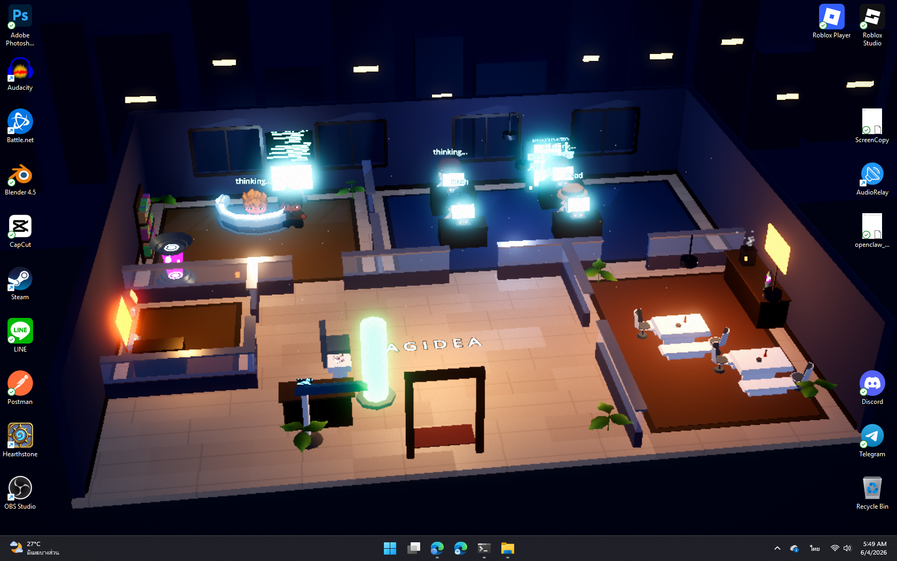
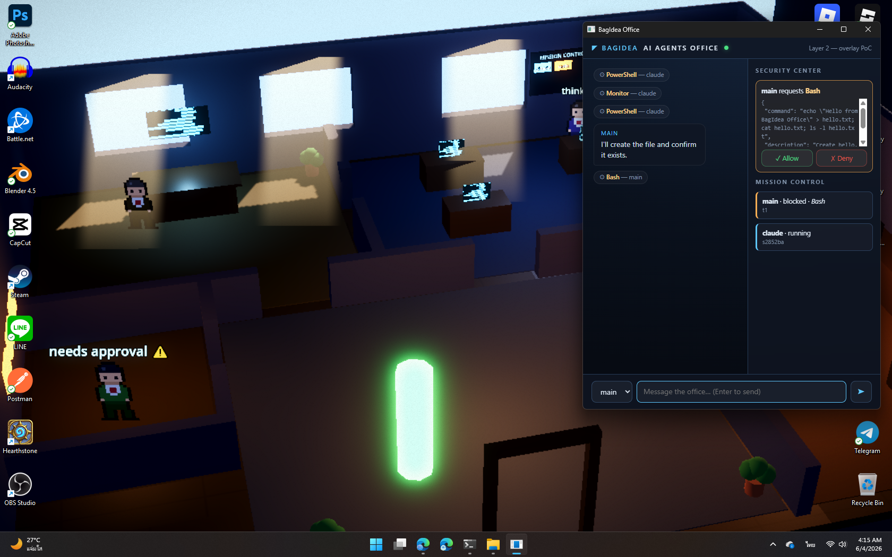
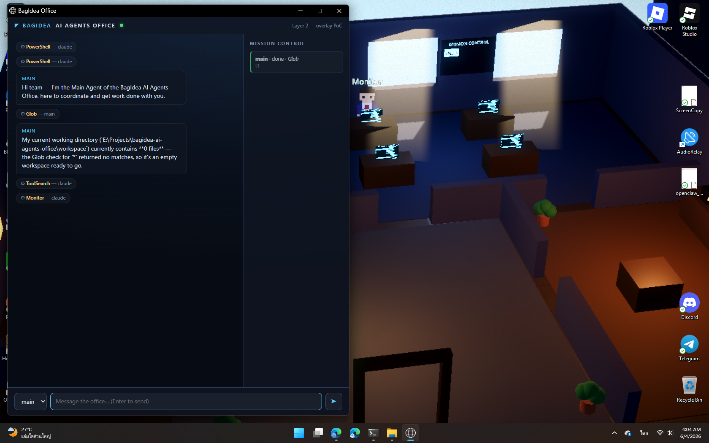
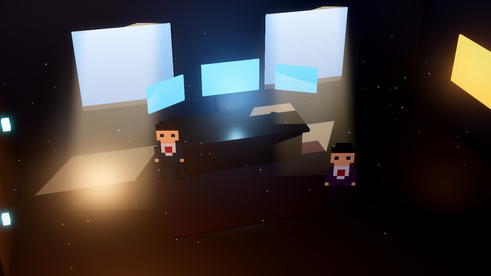

# BagIdea AI Agents Office

> **A living AI Agent Office Simulation that runs as your desktop wallpaper.**
> Every AI agent on your machine becomes a character in an HD-2D office — they walk to their desks when real work starts, gather at Security to ask for permission, and the lights follow your real local time.

Not a dashboard. Not a chat window. A **world** that renders the true state of your AI agents — Claude Code sessions, headless agent runs, custom scripts — as living pixel-art employees, behind your desktop icons.


*5 AM, real local time — agents work glowing consoles in a sci-fi office, city lights outside, the camera slowly drifting. Desktop icons render on top: this is a real wallpaper.*

> ⚠️ **Status: working prototype.** The full pipeline works end-to-end (wallpaper → daemon → real Claude Code sessions → approvals). Art uses two third-party packs (not bundled — see [Art assets](#art-assets-optional-but-recommended)): characters by [Schwarnhild](https://schwarnhild.itch.io/customizable-characters-top-down-32x32), environment by [Molten Maps SciFi Pack](https://moltenmaps.itch.io/molten-maps-scifi-pack). Without them the game falls back to procedural placeholders. Built and verified on Windows 11.

---

## Table of Contents

- [What it does](#what-it-does)
- [Screenshots](#screenshots)
- [Architecture](#architecture)
- [Repository structure](#repository-structure)
- [Requirements](#requirements)
- [Installation](#installation)
- [Running the full stack](#running-the-full-stack)
- [Using it](#using-it)
- [Event protocol (OEP)](#event-protocol-oep)
- [Performance](#performance)
- [Design documents](#design-documents)
- [Roadmap](#roadmap)

---

## What it does

### 🖥️ Live wallpaper world (Layer 1 — Godot 4)
- Renders **behind your desktop icons** (WorkerW technique, same as Wallpaper Engine)
- HD-2D look: 3D office + billboarded pixel-art sprites lit by the 3D scene, volumetric god rays, bloom, tilt-shift DOF, film grain
- **5 zones**: Executive Office, Operations Floor, Lobby, Cafeteria, Security Center
- Agents **walk** between zones on an A* waypoint graph with **4-direction animated spritesheets** (idle + walk); facing follows actual movement
- **Custom Character system**: composites layered sheets (hair/head/eyes/torso/shirt/legs) with per-agent tints — the Main Agent gets a unique look; NPCs draw from 12 premade sheets by agent-id hash; falls back to runtime-generated procedural sprites when art assets are absent
- **Real-time day/night cycle** — sun angle, color, sky and god rays follow your machine's clock; at night the city skyline outside lights up
- **Mission Control board** in-world: one card per running task, colored by state
- Lobby **status totem**: green = daemon connected, red = disconnected (truth, not decoration)
- Performance-tiered: wallpaper mode self-throttles (30 fps, reduced effects, ~9% GPU on a GTX 1060)

### 🔌 Event daemon (Layer 0 — Node.js, zero dependencies)
- WebSocket event hub — the Godot world and the overlay UI subscribe to one stream
- **Event journal** (`journal.jsonl`) with **replay on connect**: restart anything, state comes back
- **Claude Code adapter**: `POST /chat` spawns a real headless `claude -p` session and translates its stream-json output into world events
- **Claude Code hooks integration**: any Claude Code session in this project reports its tool calls — your real work animates the wallpaper automatically
- **Permission broker**: dangerous tools (Bash, Write, …) from adapter sessions are held until you approve

### 🛡️ Spatialized security
When an agent needs a dangerous tool:
1. Its character **physically walks to the Security Center** and waits (amber light pulses)
2. The overlay shows an approval card with the **exact command**
3. You click **Allow / Deny** — deny (or 50s timeout) makes the agent visibly re-plan
4. Approve, and the tool actually executes

This is real: the PreToolUse hook long-polls the daemon until you decide.

### 💬 Overlay (Layer 2)
- Glassy chat panel + Security Center approval cards + Mission Control sidebar
- Served by the daemon at `http://127.0.0.1:8787/` — open in a browser, as an Edge app window, or with the included **native Rust shell** (wry/tao, always-on-top)
- Chat with the **Main Agent** (a real Claude Code session) — it answers, uses tools, and its character works at the executive desk while it does

## Screenshots

| | |
|---|---|
|  | **Spatialized security, live** — Main Agent waiting at the Security Center ("needs approval ⚠") while the native shell shows the exact Bash command with Allow/Deny. |
|  | **Full loop** — chat with the Main Agent (real Claude session using Glob), mission sidebar, world behind. |
|  | **HD-2D visual target** — the look study that started it all: volumetric god rays, shaded billboard sprites, tilt-shift. |

## Architecture

```
┌─ Overlay (browser / Edge app / Rust shell) ─┐   ┌─ Godot 4 Wallpaper ────────────┐
│  chat · approval cards · mission sidebar    │   │  5 zones · agents walk (A*)    │
│            ▲ WebSocket /ws                  │   │  mission board · day cycle     │
└────────────┼────────────────────────────────┘   │        ▲ WebSocket /ws         │
             │                                    └────────┼────────────────────────┘
┌────────────┴─────────────────────────────────────────────┴───────────────────────┐
│  DAEMON (Node.js, zero-dep)                    http://127.0.0.1:8787              │
│  • broadcast + journal.jsonl (replay on connect)                                  │
│  • POST /chat  → spawns headless `claude -p` (stream-json → events)               │
│  • POST /event ← Claude Code hooks (your own sessions feed the world)             │
│  • POST /perm/request ←(long-poll)─ PreToolUse hook   POST /perm/respond ← UI     │
└───────────────────────────────────────────────────────────────────────────────────┘
```

Three independent processes: the **daemon** keeps agents running even if rendering dies; the **renderer** can crash/restart and rebuild from the journal; the **overlay** is just a web client. Truth lives in the daemon; the world is a renderer of truth.

## Repository structure

```
├── README.md                  ← you are here
├── docs/                      ← full V1 product-design spec (10 documents)
│   ├── 01-ux-architecture.md      … UX model, modes, user journeys
│   ├── 02-ui-wireframes.md        … Layer-2 overlay wireframes
│   ├── 03-world-layout.md         … 14-zone office design, camera, lighting
│   ├── 04-agent-behavior.md       … behavior sim: state machines, emotions
│   ├── 05-technical-architecture.md
│   ├── 06-performance.md          … GPU/CPU budgets, rendering ladder
│   ├── 07-future-expansion.md
│   ├── 08-progression.md          … XP, office levels, careers
│   ├── 09-monetization.md
│   └── 10-revolutionary-features.md
├── daemon/                    ← Layer 0 (Node.js, no npm install needed)
│   ├── server.js                  … WS hub + journal + Claude adapter + perm broker
│   ├── overlay.html               … Layer-2 web overlay (served at /)
│   ├── hook.ps1                   … Claude Code hook → daemon forwarder
│   ├── perm.ps1                   … PreToolUse permission hook (adapter sessions)
│   └── send.js                    … test event CLI
├── godot/                     ← Layer 1 (Godot 4.6 project)
│   ├── scenes/office_floor.tscn   … main scene
│   ├── scenes/executive_office.tscn … original HD-2D visual target
│   ├── scripts/world_builder.gd   … procedural office + waypoint graph + board
│   ├── scripts/agent_manager.gd   … agent-id → character choreography
│   ├── scripts/agent_sprite.gd    … runtime-generated pixel sprites + walk cycle
│   ├── scripts/event_client.gd    … WebSocket client
│   ├── scripts/office_floor.gd    … day cycle, wallpaper/screenshot modes
│   └── shaders/                   … god-ray cards, scrolling code, wood planks, grain
├── shell/                     ← native overlay shell (Rust, wry + tao)
├── tools/wallpaper.ps1        ← attach/detach the Godot window behind desktop icons
├── workspace/                 ← cwd for adapter-spawned Claude sessions
│   └── .claude/settings.json      … PreToolUse permission hook wiring
├── .claude/settings.json      ← hooks: your Claude Code sessions → the office
└── shots/                     ← screenshots (development log)
```

## Requirements

| Component | Requirement |
|---|---|
| OS | Windows 11 (wallpaper embedding uses WorkerW; macOS/Linux planned) |
| Renderer | [Godot 4.6+](https://godotengine.org/download) (standard build) |
| Daemon | [Node.js](https://nodejs.org) 18+ (no npm packages needed) |
| Agent | [Claude Code CLI](https://claude.com/claude-code) (`claude --version` ≥ 2.x) for the chat adapter & hooks |
| Shell (optional) | Rust toolchain (`cargo`) — or just use a browser / `msedge --app=` |
| GPU | Anything Vulkan-capable; verified on GTX 1060 6GB |

## Installation

```powershell
git clone https://github.com/bagidea/bagidea-ai-agents-office.git
cd bagidea-ai-agents-office
```

**1. Fix absolute paths** (one-time): the hook configs reference absolute paths. Update these to your clone location:

- `.claude/settings.json` — 3× path to `daemon\hook.ps1`
- `workspace/.claude/settings.json` — 1× path to `daemon\perm.ps1`

**2. (Optional) build the native shell:**

```powershell
cd shell
cargo build --release   # → shell/target/release/bagidea-office-shell.exe
```

### Art assets (optional but recommended)

Art packs are **not bundled** (third-party licenses). Both load at runtime —
no Godot import step — and **the game still runs without them**, falling back
to procedural placeholder visuals.

**Characters** — [Customizable Characters Top-Down 32x32 by Schwarnhild](https://schwarnhild.itch.io/customizable-characters-top-down-32x32):

```
godot/assets/characters/
├── npc/      ← contents of premade-npc-spritesheets.zip  (npc1.png … npc12.png)
└── layers/   ← contents of demo-character-idle.zip       (hair/head/eyes/torso/shirt/legs-idle.png)
```

**Environment** — [Molten Maps SciFi Asset Pack](https://moltenmaps.itch.io/molten-maps-scifi-pack):

```
godot/assets/scifi/   ← all .glb files from the pack's Assets/gtlf folder
```

Used for consoles, monitors, the briefing screen (mission board), cafeteria
furniture, plants, lamps, the orrery and more — loaded via `GLTFDocument`
with measured per-prop scaling.

That's it — the daemon has zero npm dependencies.

## Running the full stack

```powershell
# 1) Start the daemon (keep it running)
node daemon\server.js

# 2) Start the world in wallpaper mode
$p = Start-Process "C:\path\to\Godot_v4.6.x-stable_win64.exe" `
     -ArgumentList '--path', "$PWD\godot", '--', '--wallpaper' -PassThru

# 3) Embed it behind your desktop icons
.\tools\wallpaper.ps1 -Attach -ProcessId $p.Id

# 4) Open the overlay (pick one)
msedge --app=http://127.0.0.1:8787/
# or: .\shell\target\release\bagidea-office-shell.exe
# or just open http://127.0.0.1:8787/ in any browser

# Stop everything / restore your wallpaper:
.\tools\wallpaper.ps1 -Detach
```

Windowed mode (no wallpaper) for development: just run the Godot project normally, or grab a screenshot with `-- --shot --hour=10` (the `--hour` flag forces a time of day).

## Using it

### Chat with the Main Agent
Type in the overlay (or `POST /chat {"agent":"main","prompt":"..."}`). The daemon spawns a real headless Claude Code session; its character walks to the executive desk, tool names appear over its head, replies stream into the chat, and a mission card tracks it on the board.

### Watch your own Claude Code sessions
Open any Claude Code session inside this project — the hooks in `.claude/settings.json` report your prompts and tool calls to the daemon, and agent **"claude"** works at an ops desk in real time while you work. (First run: Claude Code will ask you to trust the project hooks.)

### Approve dangerous tools
Ask the Main Agent to do something that needs Bash/Write. Its character walks to the **Security Center**, the amber light pulses, and an approval card with the exact command appears in the overlay. Allow / Deny — denial (or 50s timeout) makes the agent re-plan, visibly.

### Simulate events (no Claude needed)
```powershell
node daemon\send.js agent.online rin        # rin walks in through the lobby
node daemon\send.js task.started rin "" t9  # takes a desk, mission card appears
node daemon\send.js task.progress rin Edit t9
node daemon\send.js perm.requested rin      # walks to Security, light pulses
node daemon\send.js task.completed rin "" t9
node daemon\send.js agent.offline rin       # walks out, despawns
```

## Event protocol (OEP)

One JSON event per WebSocket message / journal line: `{type, agent, task?, tool?, text?, perm?, ts}`.

| Type | Meaning | World reaction |
|---|---|---|
| `agent.online` / `agent.offline` | agent joins / leaves | walks in via lobby / walks out & despawns |
| `task.started` | mission begins | takes a desk, board card → running (cyan) |
| `task.progress` (`tool`) | tool call | tool name floats above the character |
| `task.completed` / `task.failed` | mission ends | "done ✓"/"failed ✗", card green/red, returns to cafeteria |
| `perm.requested` (`perm`, `input`) | approval needed | walks to Security, amber pulse, overlay card |
| `perm.approved` / `perm.denied` | decision | returns to desk / re-plans |
| `chat.message` (`text`) | agent speaks | speech-bubble status + overlay chat |

Push your own events from anything: `POST http://127.0.0.1:8787/event` — that's the whole integration story for custom agents. New WS clients receive a journal replay (last 80 events) so state survives restarts.

## Performance

Measured on a GTX 1060 6GB @ 1680×1050, wallpaper mode (30 fps cap, 0.66× render scale, volumetrics → god-ray cards, no SSAO/DOF):

- **~9% GPU**, ~400 MB RAM, <1% CPU; renderer pauses when occluded by fullscreen apps
- Interact mode (60 fps, all effects) ≈ 17%

See [docs/06-performance.md](docs/06-performance.md) for the full budget ladder; the production plan moves the wallpaper instance to Godot's compatibility renderer for single-digit targets on older GPUs.

## Design documents

The `docs/` folder is a complete V1 product-design specification written before the first line of code — 14-zone world design, agent behavior simulation (honesty contract: *nothing tagged is fake*), scaling to 100+ agents, progression, monetization, and the competitive thesis ([doc 10](docs/10-revolutionary-features.md): *"cockpits make agents usable; this makes them employable"*).

## Roadmap

- [x] Character art — Schwarnhild spritesheets + custom-character compositor (procedural fallback kept)
- [x] Environment furniture — Molten Maps sci-fi 3D models (consoles, monitors, briefing screen, cafeteria…)
- [ ] Full environment rebuild on the kit's wall/floor tile system (current shell is still CSG)
- [ ] Replay Theater — scrub & re-enact any past mission from the journal
- [ ] Meeting-room choreography for multi-agent collaboration
- [ ] More zones (Research Lab, Dev Studio, Dormitory, Archive Library…)
- [ ] Permission policies (always-allow rules, per-agent keycards)
- [ ] Voice (push-to-talk, wake word)
- [ ] Tauri packaging, macOS/Linux wallpaper backends
- [ ] Agent SDK adapter tiers for OpenClaw / Open Interpreter / generic JSONL

---

*Prototype built in one day with [Claude Code](https://claude.com/claude-code) — design docs in the morning, working security-approved Bash by night.*
