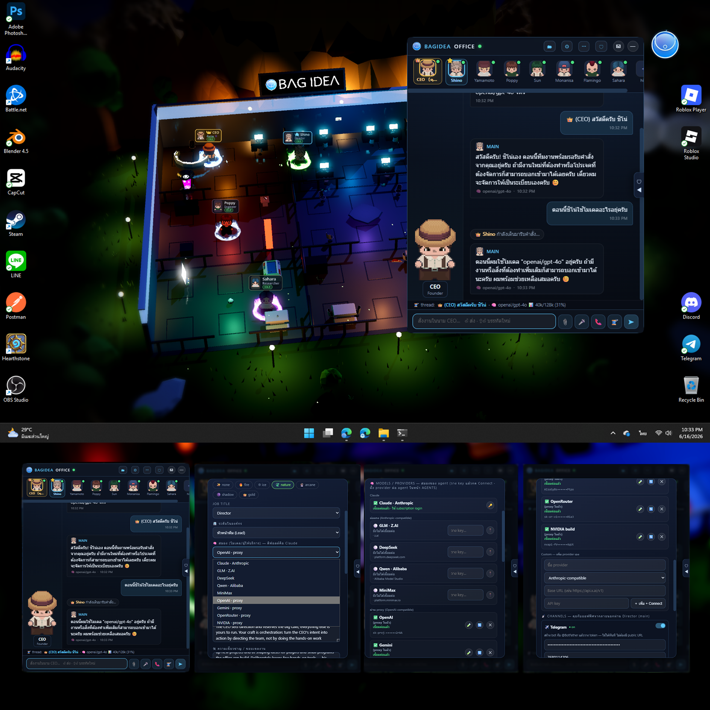
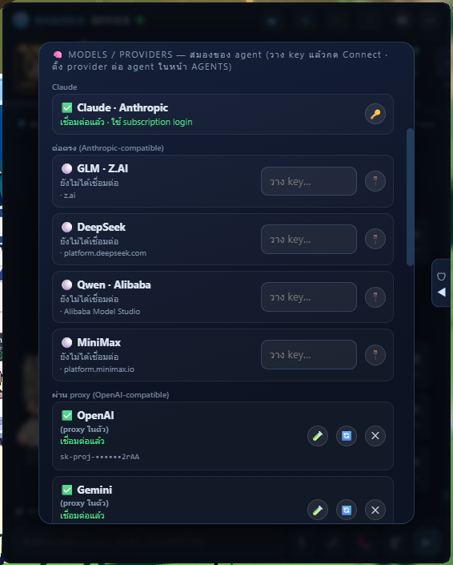
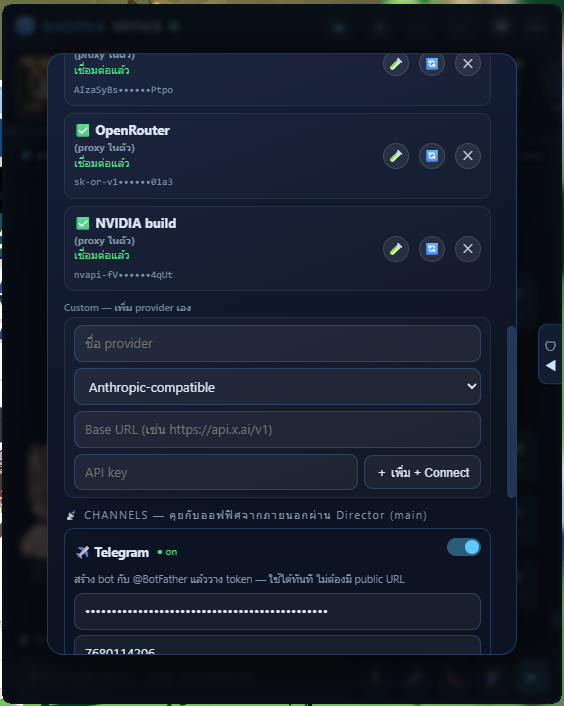
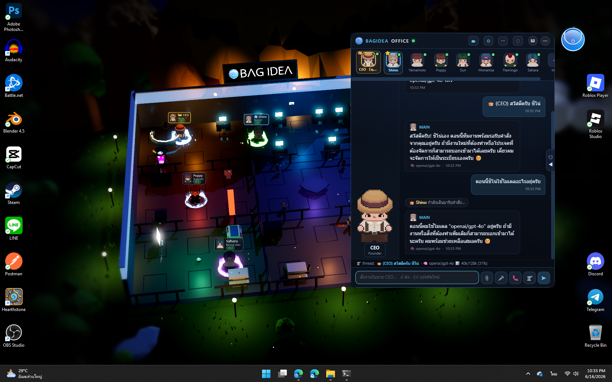

# Models & Providers — สมองถอดเปลี่ยนได้ (เลือกโมเดลต่อ agent)

ออฟฟิศรันด้วย **Claude Code CLI** เป็น engine เสมอ (tools, การแก้ไฟล์, skills,
session loop) — แต่ **"สมอง" (โมเดล) ที่อยู่เบื้องหลังเปลี่ยนได้ต่อ agent** ตั้งที่
⚙ → AGENTS → แก้ไข agent → ช่อง **🧠 สมอง (โมเดล/ผู้ให้บริการ)**

> `claude` เป็นแค่ตัวส่งคำขอ — ชี้ `ANTHROPIC_BASE_URL` ไปเจ้าอื่น มันก็คุยกับเจ้านั้นแทน
> โดย tools/loop ยังเป็นของ Claude Code (ฟรี ในเครื่อง) เปลี่ยนแค่โมเดล

## ทำไมถึงคุ้ม

- **ประหยัด** — โมเดลอย่าง DeepSeek/GLM/Qwen/MiniMax ถูกกว่า Claude หลายเท่าต่อ token
- **ไม่ต้องมี Claude plan ก็ได้** — ถ้าทุก agent ใช้ provider อื่น ก็ **ไม่แตะ credit Claude เลย**
  (ตั้ง provider อื่น + วาง key ของเจ้านั้น แล้วใช้งานได้ — Claude เป็นแค่ค่าเริ่มต้น)
- **fail-open** — agent ที่เป็น Claude หรือยังไม่ตั้ง key จะทำงานเหมือนเดิมทุกประการ

## ตั้งค่ายังไง (2 ขั้น)

**ขั้น 1 — ต่อ provider (ทำครั้งเดียว)**

⚙ → **CONNECT → 🧠 MODELS / PROVIDERS** → วาง API key ของเจ้าที่อยากใช้ → กด **🔌 Connect**
ให้ขึ้น ✅ (ระบบจะ "test key + ดึงรายชื่อโมเดล" ให้อัตโนมัติ) · key จะถูกโชว์แบบ mask
(`sk-proj-••••••2rAA`) เพื่อให้รู้ว่าใช้ key ไหนอยู่

| แยกเป็นหมวด: Claude · ต่อตรง · ผ่าน proxy | Others + custom provider เพิ่มเอง |
|---|---|
|  |  |

**ขั้น 2 — เลือกสมองให้ agent**

1. ⚙ → AGENTS → กดแก้ไข agent ที่ต้องการ
2. ช่อง **🧠 สมอง** → เลือกผู้ให้บริการ (ดีฟอลต์ = Claude)
3. ช่อง **โมเดล** ระบบเลือก default ที่ใช้ได้ให้เลย หรือพิมพ์/เลือกเองจาก dropdown
4. 💾 บันทึก — กด **บันทึกไม่ได้ถ้า provider ยังไม่ได้ connect** (กันพลาด)
5. มีผลกับ session ใหม่ของ agent นั้นทันที (session ที่ resume อยู่จะคงโมเดลเดิมจนเริ่มเธรดใหม่ — หรือจน auto-compact)

> 🧠 ghost (sub-agent) ใช้ provider เดียวกับ agent แม่อัตโนมัติ

## ผู้ให้บริการที่รองรับ

### 🟢 คุยตรง (Anthropic-compatible) — ไม่ผ่านอะไรเลย

| Provider | โมเดลแนะนำ | endpoint (สากล) | ขอ key |
|---|---|---|---|
| **Claude** (ดีฟอลต์) | opus / sonnet / haiku | — (ใช้ login/แผนของคุณ) | claude.ai หรือ ANTHROPIC_API_KEY |
| **GLM** (Z.AI) | `glm-4.6` | `https://api.z.ai/api/anthropic` | z.ai (มี coding plan แบบ key) |
| **DeepSeek** | `deepseek-v4-pro` / `-flash` | `https://api.deepseek.com/anthropic` | platform.deepseek.com |
| **Qwen** (Alibaba) | `qwen3-coder-plus` | `https://dashscope-intl.aliyuncs.com/apps/anthropic` | Alibaba Model Studio |
| **MiniMax** | `MiniMax-M3` | `https://api.minimax.io/anthropic` | platform.minimax.io |

### 🔵 ผ่าน proxy ในตัว (OpenAI-compatible) — ไม่ต้องลง LiteLLM/Python

ออฟฟิศมี **proxy แปลร่าง Anthropic ↔ OpenAI ฝังในตัว (zero-dependency)** ให้แล้ว ใส่แค่ key:

| Provider | โมเดลแนะนำ | รูปแบบชื่อโมเดล |
|---|---|---|
| **OpenAI** | `gpt-4o` | ชื่อเปล่า |
| **Gemini** (Google) | `gemini-2.5-flash` | ชื่อเปล่า |
| **OpenRouter** | `openai/gpt-4o`, `anthropic/claude-…` | **`vendor/model`** |
| **NVIDIA build** | `meta/llama-3.3-70b-instruct` | **`vendor/model`** |
| **Custom** | อะไรก็ได้ | ตามเจ้านั้น |

> daemon รับ request จาก claude (ภาษา Anthropic) → แปลเป็น OpenAI → ยิงไปปลายทางด้วย key ใน CONNECT
> (key จริงไม่เข้า sandbox) · ถ้าไม่มี key → fall back เป็น Claude (ไม่ค้าง)

### 🛠 Custom provider — เพิ่มเองได้

ใน CONNECT มีฟอร์ม **Custom** — ใส่ **ชื่อ + Base URL + API key** เลือกได้ว่าจะคุยแบบ
**Anthropic-compatible** หรือ **OpenAI-compatible** → ใครมี **LiteLLM gateway** ของตัวเองอยู่แล้ว
ก็ชี้ Base URL มาที่ gateway นั้นได้เลย (เลี่ยง LiteLLM เวอร์ชัน 1.82.7/1.82.8 ที่เคยติด malware)

## 🆓 ลองฟรีได้ — แต่มีลิมิต

| Provider | ฟรี? | ข้อจำกัดที่ต้องรู้ |
|---|---|---|
| **NVIDIA build** | ✅ ฟรีทดสอบ | **rate limit ต่ำ (~40 req/นาที)** — งาน agent ที่แนบ context หนักชน 429 เร็ว เหมาะกับงานเบา/ลองเล่น |
| **OpenRouter** | ✅ มีโมเดล `:free` | **จำกัดต่อวัน + อาจรอคิว** · ต้องใช้ id แบบ `vendor/model` · งานหนักแนะนำเติมเครดิต |
| **Gemini** | ✅ โควต้าใจดี | เหมาะกับผู้ช่วยทั่วไป — flash ฟรีค่อนข้างเยอะ |
| **OpenAI** | ❌ จ่ายตามใช้ | **Tier 1 = 30k tokens/นาที** เล็กไปสำหรับงาน agent หนัก (แต่ auto-compact ช่วยได้ ดูด้านล่าง) |

## ♻️ Auto-Compact + Auto-New-Thread — ทำงานกับ *ทุกโมเดล*

> คุยยาวแค่ไหนก็ไม่ตัน ไม่ค้าง ไม่ต้องเปิด thread ใหม่เอง

ปกติคุยยาวๆ context จะเต็มแล้วพัง — Claude Code แก้ให้เฉพาะ Claude แต่ออฟฟิศทำให้
**ทุกโมเดล**ทำได้อัตโนมัติ:

- 🧠 **Proactive** — ก่อนคุยต่อทุกครั้ง เช็คขนาดบทสนทนาเทียบ context window ของโมเดลนั้น ถ้าใกล้เต็ม → **สรุปด้วย Claude → เปิด thread ใหม่ → ทำงานต่อ** ก่อนจะพัง
- 🛟 **Reactive** — ถ้าโมเดลปัดเพราะ rate-limit / context เต็มที่คาดไม่ถึง → กู้ให้แบบเดียวกัน (rate-limit ชั่วคราวจะ retry เองไม่เด้ง error)
- 🪄 **ความต่อเนื่องไม่หาย** — สรุปด้วย **Claude** (สมองใหญ่) แล้วป้อนให้ thread ใหม่ · หน้าจอ **พาคุณตามไป thread ใหม่** ให้เอง ไม่งงว่าน้องหายไปไหน

ปรับ context window ต่อ provider เองได้ที่ registry `providerConfig.
.contextWindow`
(และ budget ที่ใช้ตัดสินใจ compact ที่ `providerConfig.
.contextBudget`)

## 📊 มอนิเตอร์

- 🏷 **ทุกข้อความบอกโมเดลที่ใช้** + แถบ **context ใช้ไปกี่ %** (เช่น `gpt-4o · 40k/128k`)
- 🧠 **หน้า BRAINS** (sidebar 🛡) — สถานะ connect ของทุก provider + context ของทุก agent แบบสด
- 💰 **หน้า STATS** (🗂 Office Ops) — ค่าใช้จ่ายแยกราย provider (ประมาณการจาก token จริง) + ยอดรวมต่อวัน

> ค่าใช้จ่าย provider อื่นเป็น **ประมาณการ** (provider พวกนี้ไม่ส่งบิลจริงเหมือน Claude) —
> คำนวณจาก token × ราคาสาธารณะโดยประมาณ ปรับเรตได้ที่ `BRAIN_PRICES` ใน `daemon/server.js`

## คำแนะนำการจัดทีม (tiered)

ความแม่นของ tool-use สำคัญต่อ "เงินที่เสียไปกับงานพัง/ทำซ้ำ" — เลือกตามงาน:

| บทบาท | แนะนำ | เหตุผล |
|---|---|---|
| **Director / main** (วางแผน, มอบงาน) | **Claude** | leverage สูง ผิดแล้วกระทบทั้งทีม — เก็บสมองดีไว้ |
| **น้อง build โปรเจค** | **DeepSeek V4 Pro** / GLM | ใกล้ Claude, ถูกกว่า ~10 เท่า, ต่อตรง |
| **น้อง assistant / social** | Qwen / MiniMax / Gemini | งานเบา ไม่ต้องแม่น, ถูกสุด |

> โมเดลถูกเหมาะกับงาน assistant/chat (มีคนดู แก้ได้ทันที) มากกว่างาน autonomous loop ยาวๆ

## ตัวตนของโมเดล

โมเดลที่สลับเข้ามาจะอ่าน system prompt ของ Claude Code แล้วอาจอ้างว่าตัวเองเป็น Claude —
ออฟฟิศฉีด note บอก backend จริงทุกเทิร์น ดังนั้นถ้าถาม **"ใช้โมเดลอะไร"** น้องจะตอบตามจริง
(เช่น `gpt-4o`) ตรงกับแท็กที่โชว์ใต้ข้อความ

## หมายเหตุเรื่อง credit / นโยบาย

- เลือก provider อื่น = **จ่ายเจ้านั้น ไม่แตะ credit Claude** — `claude` แค่ส่งคำขอไปปลายทางที่ตั้ง
- การเลือกโมเดล/ผู้ให้บริการ **ไม่ผิดนโยบาย** — เป็นฟีเจอร์มาตรฐาน
- token เก็บใน `registry.json` ในเครื่องเท่านั้น (ที่เดียวกับ API keys อื่น) ไม่ถูกส่งไป Anthropic

> **endpoint จีน** ต่างจากสากล — ถ้าอยู่จีนแผ่นดินใหญ่ตั้ง baseUrl เองได้ (registry `providerConfig.
.baseUrl`):
> Qwen `https://dashscope.aliyuncs.com/apps/anthropic` · MiniMax `https://api.minimaxi.com/anthropic` (มี "i" เพิ่ม)
