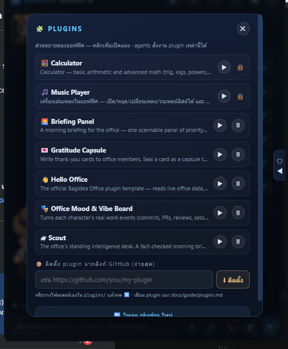

# Writing a BagIdea Office plugin

A **plugin** extends the office in real ways — a panel the user opens, HTTP
routes, and **commands agents can drive**. Plugins are plain folders; no build
step, zero dependencies. Drop one in `plugins/` and reload.



> ⚙ → **PLUGINS**: see installed plugins, open each one's panel, remove them, or
> **install from any GitHub repo** — paste a URL and click install (you can start
> from the official template: `github.com/bagidea/bagidea-office-template`)

This guide is written so a **person** OR an **agent** can build a working plugin
from scratch. The `music` plugin and the `hello` template (§7) are full examples to read.

> 📦 **The office installs empty — no plugins ship with it** at all (see `.gitignore`:
> `plugins/*`). The office owner installs them one at a time from the **Plugins Hub**
> (each one is a GitHub repo that gets cloned in). See how in the **"Use a ready-made
> plugin"** section below.

## Use a ready-made plugin (start with 🎵 Music Player)

The first time you open the office there are **no plugins yet**. Install one from ⚙ → **🧩 PLUGINS**:

1. Open the **🧩 PLUGINS** panel and go to the **Hub** tab (the official catalog lives in `web/plugins.json`)
2. Click install on **🎵 Music Player** (the first official plugin) — the office clones it from the repo automatically
3. (Or paste the URL of any GitHub repo that has a `plugin.json` and click install)

**Using 🎵 Music Player** — open its panel, then:
- **Add songs** — upload audio files into the playlist (Thai/multilingual filenames supported)
- **Play/pause/next/previous** — control buttons + a seek bar you can drag
- **Loop the playlist + adjust the volume**
- **Remove several songs at once** — multi-select rows and delete them in one go
- **Agents can drive it too** — agent commands: `play / pause / next / prev / loop / volume / remove / status`
  (e.g. say "play some music" and the team does it, and the panel open on screen updates live)

Remove a plugin with the 🗑 button on the 🧩 panel (see §6 Installing / removing)

---

## 1. Anatomy

```
plugins/<id>/
  plugin.json     ← manifest (required)
  index.js        ← server-side logic (optional)
  panel.html      ← an overlay UI the user opens (optional)
  data/           ← your plugin's private storage (gitignored, auto-created)
  static/...      ← any files panel.html loads (served at /plugin/<id>/static/…)
```

A plugin needs **only** `plugin.json`. Add `index.js` for server power, and/or
`panel.html` for a UI.

---

## 2. `plugin.json`

```json
{
  "id": "hello",
  "name": "👋 Hello Office",
  "version": "1.0.0",
  "description": "What it does, in one line.",
  "panel": "panel.html",
  "window": { "w": 460, "h": 620, "resizable": true },
  "commands": [
    { "name": "greet", "args": "[name]", "desc": "Post a friendly hello to the office feed" }
  ],
  "needsKeys": [],
  "enabled": true
}
```

| field | meaning |
|---|---|
| `id` | unique slug (defaults to the folder name) |
| `name` | shown in the UI / `bagidea plugins`. **Start it with an emoji** — that leading emoji becomes your plugin's icon in the office's 🧩 Plugins panel (e.g. `"🧪 Agent Workbench"`). Omit it and the office falls back to a default 🧩. |
| `panel` | the HTML file to open as a panel (omit for headless plugins) |
| `window` | *(optional)* default size when the panel is **popped out into its own window** (see §4): `{ "w": <px>, "h": <px>, "resizable": true|false }`. Defaults to `900×680`, resizable. Pick a size that fits your UI; set `resizable: false` for a fixed-size tool. |
| `commands` | what **agents** can call — each `{name, args, desc}` |
| `needsKeys` | main API key names this plugin needs (informational) |
| `enabled` | set `false` to ship-but-disable |

---

## 3. `index.js` — the server side

`index.js` exports a factory that receives `ctx` and returns handlers:

```js
module.exports = (ctx) => ({
  // Called when an agent or the panel POSTs /plugin/<id>/cmd {cmd, args}.
  onCommand(cmd, args, reply) {
    if (cmd === "calc") return reply({ ok: true, result: 42 });
    return reply({ ok: false, msg: "unknown command" });
    // async is fine: return a Promise, or call reply() later.
  },
  // Custom HTTP routes at /plugin/<id>/<name>
  routes: {
    eval(req, res, { readBody, readBodyRaw }) {
      res.writeHead(200, { "content-type": "application/json" });
      res.end(JSON.stringify({ ok: true }));
    },
  },
});
```

### `ctx` — what a plugin can reach
| field | use |
|---|---|
| `ctx.broadcast(event, persist?)` | push a live event to every panel + the office feed (WS). Use `{type:"plugin.event", plugin:"<id>", ...}` |
| `ctx.feed(text, agentId?)` | post a visible line to the office feed stream (defaults to the `main` agent) |
| `ctx.reg` | the office registry (agents, roles, settings) — read it freely |
| `ctx.saveReg()` | persist registry changes you made (after mutating `ctx.reg`) |
| `ctx.workspace` | absolute path to the agents' workspace |
| `ctx.daemonDir` | the daemon folder — read office data files (`registry.json`, `projects.json`, …) |
| `ctx.dataDir` | `plugins/<id>/data` — your private storage |
| `ctx.pluginDir` | your plugin's folder (for `static/`, bundled files) |
| `ctx.manifest` | your parsed `plugin.json` |
| `ctx.log(msg)` | write to the daemon log |
| `ctx.runClaude(agentId, prompt, opts?)` | run a real Claude Code turn as that agent — the same engine the office uses (advanced) |

### Built-in HTTP routes (free, no code)
- `GET /plugin/<id>/panel` → serves your `panel.html`
- `GET /plugin/<id>/static/<file>` → serves files from the plugin folder
- `POST /plugin/<id>/cmd` `{cmd,args}` → calls your `onCommand`

`reply(data)` sends JSON back. For binary/streaming, write to `res` directly in a
custom route (see `music`'s `track` route — it streams audio with HTTP Range; and
its `upload` route accepts a raw file body via `readBodyRaw`).

> **Non-ASCII args (Thai/Chinese/emoji words):** when an agent drives a command from
> the shell, do **not** put non-English text inline (`-d "{...}"`) — on Windows the shell
> codepage corrupts it to `?` before `curl` even runs. Write the JSON body to a UTF-8 file
> and send it: `curl ... --data-binary @body.json`. The daemon and panels handle UTF-8
> fine; only the inline command line is unsafe.

> **Don't ASCII-strip filenames or text (the office speaks 14 languages):** a
> sanitizer like `name.replace(/[^\w.\- ]/g, "_")` deletes every Thai/Chinese/Arabic
> character (`\w` is ASCII-only) — that turned Thai song names into `____` in the Music
> Player. Strip only what's unsafe and keep all letters:
> ```js
> const safe = raw.split(/[\\/]/).pop()        // basename → blocks ../ traversal
>   .replace(/[\x00-\x1f<>:"|?*]/g, "_")        // control + Windows-reserved → _
>   .replace(/^\.+/, "").trim();                // no leading dots
> ```
> In `panel.html`, give `font-family` a multilingual fallback (e.g.
> `system-ui,"Segoe UI","Leelawadee UI",Tahoma,"Noto Sans Thai","Noto Sans CJK",sans-serif`)
> so non-Latin text renders instead of blank glyphs.

---

## 4. `panel.html` — the UI

A normal HTML file. It runs in the overlay webview and can call your routes:

```js
// read state
const s = await (await fetch("/plugin/<id>/state")).json();
// send a command (the SAME path agents use)
await fetch("/plugin/<id>/cmd", { method: "POST",
  headers: { "content-type": "application/json" },
  body: JSON.stringify({ cmd: "play", args: "1" }) });
// live updates when an AGENT changes things
const ws = new WebSocket("ws://127.0.0.1:8787/ws");
ws.onmessage = (m) => { const e = JSON.parse(m.data);
  if (e.type === "plugin.event" && e.plugin === "<id>") refresh(); };
```

Keep the dark theme (`background:#0c1322; color:#dbe7ff; accent #5ec8ff`) so it
matches the office.

**Pop-out window.** Besides opening inside the overlay, the user can pop your
panel out into its **own resizable OS window** (the ⤢ button). It opens inside a
custom dark title-bar frame — your `panel.html` is the body. Two things to design
for: (1) make the layout **fluid** (use `%`/`vh`/flex, not a hard-coded size) so
it looks right at any window size; (2) set a sensible default + `resizable` via
the `window` field in `plugin.json` (above). The same panel serves both the
in-overlay view and the window, so build it once. Each plugin opens **one**
window at a time (re-clicking ⤢ just focuses it); different plugins open side by
side. This is how a plugin can grow into a real, standalone app under BagIdea
Office.

---

## 5. Agents and plugins

Every plugin's `commands` are injected into agent prompts automatically (see
`plugins.js → agentNote()`), so an agent can drive your plugin with a Bash call:

```bash
curl -s -X POST http://127.0.0.1:8787/plugin/hello/cmd \
  -H "content-type: application/json" -d '{"cmd":"greet","args":"team"}'
```

Because the panel and agents both go through `/cmd`, an agent saying *"loop the
playlist"* really controls the panel open in front of the user.

**An agent can also CREATE a plugin**: write the folder + files under `plugins/`,
then `curl -s -X POST http://127.0.0.1:8787/plugins/reload -H "x-bagidea-ui: 1"`.
Point the agent at this guide and it has everything it needs.

---

## 6. Installing / removing

> **Fastest start:** fork the template repo
> [`bagidea/bagidea-office-template`](https://github.com/bagidea/bagidea-office-template)
> — a working plugin (`hello`) that reads live office data, posts to the feed and
> shows every pattern here, plus a `CLAUDE.md` so an agent can extend it. Then
> `bagidea plugin install <your-fork-url>`.

- **Local**: drop the folder in `plugins/`, then restart, or `POST /plugins/reload`
  (the 🔄 button on the 🧩 panel).
- **From GitHub**: `bagidea plugin install https://github.com/you/your-plugin`
  (clones into `plugins/`; the repo must contain `plugin.json`).
- **Remove**: `bagidea plugin remove <id>` (or the 🗑 button; core plugins are
  protected).

---

## 7. Three worked examples

Real, complete plugins to **read while building** — all installable from the 🧩 Hub:

- **🎵 Music Player** ([repo](https://github.com/bagidea/bagidea-office-music-player-plugin))
  — playlist with upload/multi-select-remove, play/pause/next/prev/loop/volume, a seek bar,
  audio streamed with HTTP Range, agent commands, live WS sync.
- **🧮 Calculator** ([repo](https://github.com/bagidea/bagidea-office-calculator-plugin))
  — a safe math evaluator (tokenizer → shunting-yard → RPN, **no `eval`/`Function`**):
  arithmetic plus trig/logs/powers/roots/factorial/constants, shared by the panel and the
  `calc` agent command — one engine behind both a panel and a command.
- **👋 Hello Office** — the official **template**
  ([repo](https://github.com/bagidea/bagidea-office-template)): reads live office data, posts
  to the feed, `greet`/`roster` commands, and shows every plugin pattern. Fork it to start your own.

---

## 8. Checklist

- [ ] `plugin.json` with a unique `id`, `name`, `description`
- [ ] (optional) `index.js` exporting `(ctx) => ({ onCommand?, routes? })`
- [ ] (optional) `panel.html` for a UI
- [ ] commands listed in the manifest so agents can use them
- [ ] private state in `ctx.dataDir`, never hard-coded paths
- [ ] broadcast `plugin.event` so open panels stay live
- [ ] test: `POST /plugin/<id>/cmd` returns what you expect
