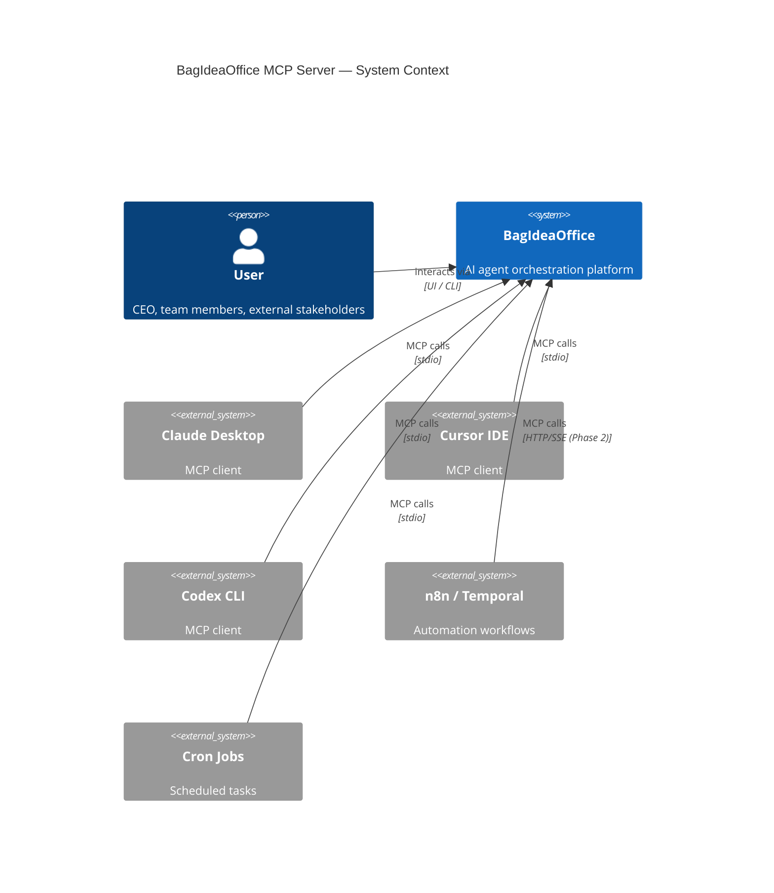
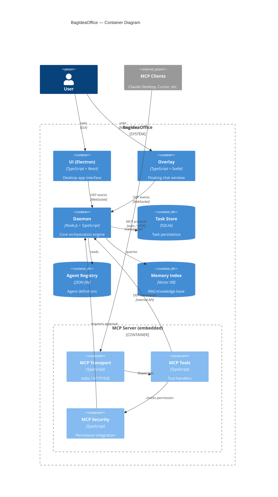
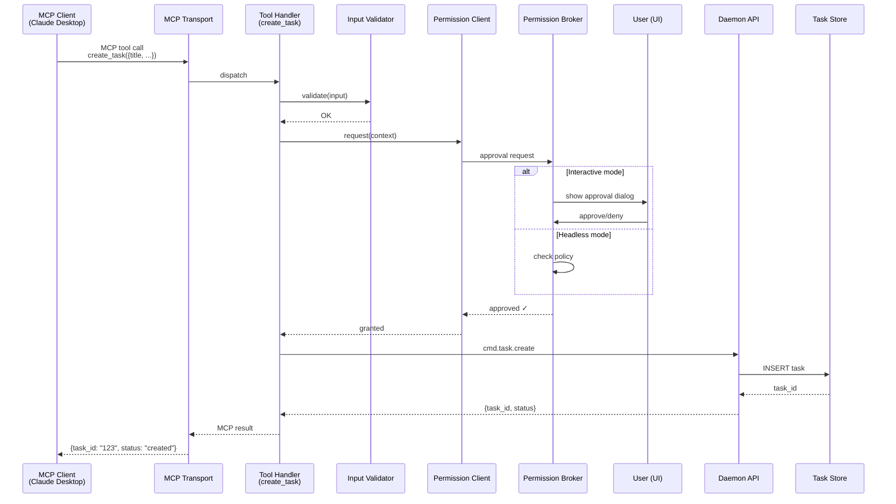

# BagIdeaOffice MCP Server — Architectural Proposal

**เวอร์ชัน:** v1.0
**ผู้เขียน:** Arthit (System Architect)
**วันที่:** 2026-06-23
**สถานะ:** Draft — รอ review จากทีม
**Input:** Requirements Document v0.1 by Nida (BA)

---

## Executive Summary

เอกสารนี้คือ technical blueprint สำหรับ BagIdeaOffice MCP server — หน้าประตูที่ external AI agents และ automation workflows ใช้เชื่อมต่อกับออฟฟิศผ่านมาตรฐาน Model Context Protocol (MCP)

**Core Architecture Decisions:**
- **Embed ใน daemon** — แชร์ state, lifecycle, และ security model ที่มีอยู่แล้ว
- **Dual transport** — stdio สำหรับ local clients, HTTP/SSE สำหรับ remote
- **Permission Broker integration** — ทุก state-changing operation ต้องผ่าน approval
- **Phased rollout** — เริ่มจาก read-only tools แล้วค่อยเพิ่ม write capabilities

---

## 1. Context & Scope

### 1.1 Problem Statement

BagIdeaOffice มีระบบภายในที่สมบูรณ์ (agent management, task system, memory, plugins) แต่ยังไม่มี standard interface สำหรับ external systems — ต้องเขียน custom adapter สำหรับแต่ละ integration

### 1.2 Solution

MCP server เป็น **translation layer** ที่:
- Expose ความสามารถของออฟฟิศเป็น MCP tools/resources/prompts
- แปลง MCP calls เป็น OEP events ที่ daemon เข้าใจ
- บังคับใช้ Permission Broker สำหรับทุก state-changing operation

### 1.3 Scope

**In Scope (Phase 1 - MVP):**
- Read-only tools: `list_agents`, `list_tasks`, `get_health`, `get_feed`
- Write tools (with approval): `create_task`, `post_feed`
- stdio transport
- Permission Broker integration
- Unit + integration tests (≥80% coverage)

**Out of Scope:**
- HTTP/SSE transport (Phase 2)
- Memory tools, plugin commands, workflows (Phase 2)
- Resource URIs, prompts, streaming (Phase 3)
- Multi-office federation (Phase 3)

---

## 2. Architecture Decisions (ADRs)

### ADR-001: MCP Server Deployment Model

**Status:** Accepted
**Date:** 2026-06-23
**Deciders:** Arthit (Architect), Director

#### Context

MCP server สามารถ deploy ได้ 3 แบบ:
- **A) Embed ใน daemon process** — แชร์ memory, state, lifecycle
- **B) Process แยก** — crash isolation, deploy อิสระ
- **C) Plugin** — ใช้ plugin framework ที่มีอยู่แล้ว

#### Decision

**เลือก Option A: Embed ใน daemon**

#### Rationale

1. **Simplicity** — daemon มี state (registry, task store, WebSocket connections) ที่ MCP server ต้องเข้าถึง การ embed ทำให้เข้าถึงได้โดยตรง ไม่ต้อง IPC
2. **Lifecycle consistency** — daemon start/stop → MCP server start/stop อัตโนมัติ ไม่ต้อง manage process แยก
3. **Security model reuse** — daemon มี Permission Broker อยู่แล้ว MCP server ใช้ได้ทันที
4. **Resource efficiency** — ไม่ต้อง spawn process ใหม่, แชร์ WebSocket connection pool

**Trade-offs:**
- ❌ Crash isolation ต่ำกว่า — ถ้า MCP server crash อาจดึง daemon ลงด้วย → **Mitigation:** Error boundaries + try-catch ทุก MCP handler
- ❌ Deploy อิสระไม่ได้ → **Mitigation:** Accept ได้ เพราะ MCP server ต้องรันคู่กับ daemon อยู่แล้ว (NFR3)

#### Consequences

- MCP server code อยู่ใน `daemon/src/mcp-server/` directory
- Daemon startup sequence เพิ่ม MCP server initialization
- ใช้ dependency injection เพื่อให้ test ได้ง่าย

---

### ADR-002: Transport Strategy

**Status:** Accepted
**Date:** 2026-06-23
**Deciders:** Arthit (Architect), Director

#### Context

MCP protocol รองรับ 2 transports:
- **stdio** — standard สำหรับ Claude Desktop, Codex, local clients
- **HTTP/SSE** — สำหรับ remote clients, web integrations

#### Decision

**Phase 1: stdio only**
**Phase 2: เพิ่ม HTTP/SSE**

#### Rationale

1. **MVP focus** — Requirements doc ระบุ stdio เป็น must-have สำหรับ Phase 1
2. **Complexity management** — HTTP/SSE ต้อง auth, session management, CORS — เพิ่ม complexity ที่ยังไม่จำเป็น
3. **Prior art** — agy-mcp ใช้ stdio transport และทำงานได้ดีกับ Claude Desktop

#### Consequences

- Phase 1 MCP server ใช้ `StdioServerTransport` จาก `@modelcontextprotocol/sdk`
- Phase 2 จะเพิ่ม `SSEServerTransport` + Express server
- Architecture ต้องรองรับ transport abstraction ตั้งแต่แรก

---

### ADR-003: Permission Broker Integration Pattern

**Status:** Accepted
**Date:** 2026-06-23
**Deciders:** Arthit (Architect), Krit (Security Lead)

#### Context

Permission Broker ใน daemon เป็น **interactive approval system** — แสดง dialog ให้ user approve/deny operation แต่ MCP server อาจถูกเรียกจาก headless clients (cron jobs, automation)

#### Decision

**ใช้ async approval pattern with timeout:**

```
MCP Client → MCP Server → Permission Broker → User Dialog → Response
                ↓ (wait with timeout)
           [timeout: 60s]
```

**Implementation:**
1. MCP tool handler เรียก `permissionBroker.request(context)`
2. Permission Broker แสดง dialog ใน UI (ถ้ามี) หรือ log warning (ถ้า headless)
3. MCP server wait ด้วย Promise + timeout (60 วินาที)
4. ถ้า timeout → return error "Permission request timed out"
5. ถ้า approved → execute operation
6. ถ้า denied → return error พร้อม reason

#### Rationale

1. **Respect existing security model** — ไม่ bypass Permission Broker (FR-S1, FR-S3)
2. **User experience** — interactive clients ได้ approval dialog, headless clients ต้อง configure policy ล่วงหน้า
3. **Timeout prevents hanging** — MCP client ไม่ block ถาวร

#### Consequences

- ทุก write tool ต้อง check permission ก่อน execute
- Headless automation ต้องใช้ Security Center ตั้ง policy = "allow" ล่วงหน้า
- Error messages ต้องชัดเจน (FR-S2)

---

### ADR-004: Technology Stack

**Status:** Accepted
**Date:** 2026-06-23
**Deciders:** Arthit (Architect), Engineering Team

#### Context

ต้องเลือก language, framework, และ SDK สำหรับ MCP server

#### Decision

**Stack:**
- **Language:** TypeScript (strict mode)
- **Runtime:** Node.js 20+ (daemon ใช้ Node.js อยู่แล้ว)
- **MCP SDK:** `@modelcontextprotocol/sdk` v1.x
- **Testing:** Vitest (fast, ESM-native)

#### Rationale

1. **Consistency** — daemon เขียนด้วย TypeScript, ใช้ shared codebase ได้
2. **Prior art** — agy-mcp ใช้ stack นี้และมี 59 tests เป็น reference
3. **Type safety** — MCP SDK มี TypeScript types ครบถ้วน
4. **Developer experience** — ทีมคุ้นเคย TypeScript + Node.js

#### Consequences

- MCP server code อยู่ใน `daemon/src/mcp-server/**/*.ts`
- ใช้ `tsconfig.json` เดียวกับ daemon
- Build output: `daemon/dist/mcp-server/`

---

### ADR-005: Error Handling Strategy

**Status:** Accepted
**Date:** 2026-06-23
**Deciders:** Arthit (Architect), May (QA Lead)

#### Context

MCP server ต้อง handle errors หลายประเภท:
- Daemon unavailable
- Permission denied
- Invalid input
- Timeout
- Internal errors

#### Decision

**ใช้ structured error hierarchy + error boundaries:**

```typescript
class MCPError extends Error {
  constructor(
    public code: string,        // "DAEMON_UNAVAILABLE", "PERMISSION_DENIED", etc.
    message: string,
    public details?: unknown
  ) {
    super(message);
  }
}

class DaemonUnavailableError extends MCPError {
  constructor() {
    super("DAEMON_UNAVAILABLE", "BagIdeaOffice daemon is not running");
  }
}

class PermissionDeniedError extends MCPError {
  constructor(reason: string) {
    super("PERMISSION_DENIED", `Permission denied: ${reason}`);
  }
}
```

**Error boundaries:**
- ทุก tool handler wrap ด้วย try-catch
- Global error handler ใน MCP server initialization
- Log errors to daemon log (ไม่ expose internal details)

#### Rationale

1. **Consistent error format** — MCP clients parse error ได้ง่าย
2. **Security** — ไม่ expose internal paths, credentials (FR-S6)
3. **Debuggability** — error code + details ช่วย troubleshoot
4. **Prior art** — agy-mcp QA phase 4 ใช้ pattern นี้

#### Consequences

- สร้าง `errors.ts` module ใน `mcp-server/`
- ทุก tool return `MCPError` หรือ subclass
- Error messages เป็น English (internationalization)

---

## 3. System Architecture

### 3.1 C4 Model — Level 1: System Context



**คำอธิบาย:**
- BagIdeaOffice เป็นระบบเดียวที่ user interact ด้วย
- External MCP clients (Claude Desktop, Cursor, Codex, automation tools) เชื่อมต่อผ่าน MCP protocol
- Phase 1 ใช้ stdio transport, Phase 2 เพิ่ม HTTP/SSE

---

### 3.2 C4 Model — Level 2: Container Diagram



**คำอธิบาย:**
- MCP Server เป็น container ที่ **embed ใน daemon process**
- มี 3 components: Transport, Tools, Security
- Tools เรียก daemon ผ่าน internal API
- Security integration กับ Permission Broker ที่มีอยู่แล้ว

---

### 3.3 C4 Model — Level 3: Component Diagram (MCP Server)

```mermaid
C4Component
  title MCP Server — Component Diagram

  Container_Boundary(mcp_server, "MCP Server") {
    Component(transport, "Transport Layer", "StdioServerTransport", "MCP protocol handling")
    Component(tools_registry, "Tools Registry", "Map<name, handler>", "Tool registration")

    Component(agent_tools, "Agent Tools", "TypeScript", "list_agents, get_agent, summon_agent")
    Component(task_tools, "Task Tools", "TypeScript", "list_tasks, create_task, cancel_task")
    Component(feed_tools, "Feed Tools", "TypeScript", "get_feed, post_feed")
    Component(health_tools, "Health Tools", "TypeScript", "get_health, get_stats")

    Component(permission_client, "Permission Client", "TypeScript", "Permission Broker integration")
    Component(error_handler, "Error Handler", "TypeScript", "Structured error handling")
    Component(input_validator, "Input Validator", "Zod schemas", "Request validation")
  }

  Container(daemon, "Daemon") {
    Component(permission_broker, "Permission Broker", "TypeScript", "Approval system")
    Component(oep_api, "OEP API", "TypeScript", "Office Event Protocol")
    Component(task_manager, "Task Manager", "TypeScript", "Task lifecycle")
  }

  Rel(transport, tools_registry, "routes to")
  Rel(tools_registry, agent_tools, "dispatches")
  Rel(tools_registry, task_tools, "dispatches")
  Rel(tools_registry, feed_tools, "dispatches")
  Rel(tools_registry, health_tools, "dispatches")

  Rel(agent_tools, input_validator, "validates")
  Rel(task_tools, input_validator, "validates")
  Rel(feed_tools, input_validator, "validates")

  Rel(task_tools, permission_client, "requests approval")
  Rel(feed_tools, permission_client, "requests approval")

  Rel(permission_client, permission_broker, "approval request", "async")

  Rel(agent_tools, oep_api, "reads registry")
  Rel(task_tools, task_manager, "creates/lists tasks")
  Rel(feed_tools, oep_api, "posts/reads feed")
  Rel(health_tools, daemon, "reads state")

  Rel(error_handler, transport, "formats errors")

  UpdateLayoutConfig($c4ShapeInRow="3", $c4BoundaryInRow="1")
```

**Components:**

1. **Transport Layer** — จัดการ MCP protocol (stdio/HTTP), serialize/deserialize messages
2. **Tools Registry** — Map ของ tool name → handler function
3. **Agent/Task/Feed/Health Tools** — Tool handlers แต่ละประเภท
4. **Permission Client** — Wrapper สำหรับเรียก Permission Broker
5. **Input Validator** — Zod schemas สำหรับ validate input
6. **Error Handler** — แปลง errors เป็น MCP error format

---

### 3.4 Data Flow Diagram



**Flow อธิบาย:**
1. MCP Client เรียก `create_task` tool
2. Transport layer route ไป tool handler
3. Tool validate input ด้วย Zod
4. Tool ขอ permission จาก Permission Broker
5. Broker แสดง dialog (interactive) หรือ check policy (headless)
6. ถ้า approved → เรียก Daemon API สร้าง task
7. Return task_id กลับ client

---

## 4. Technical Design

### 4.1 Directory Structure

```
daemon/
├── src/
│   ├── mcp-server/
│   │   ├── index.ts                 # Entry point, server initialization
│   │   ├── transport.ts             # Transport abstraction (stdio/HTTP)
│   │   ├── errors.ts                # Error classes (MCPError, etc.)
│   │   ├── validator.ts             # Zod schemas for input validation
│   │   │
│   │   ├── tools/
│   │   │   ├── index.ts             # Tools registry
│   │   │   ├── agents.ts            # list_agents, get_agent, summon_agent
│   │   │   ├── tasks.ts             # list_tasks, create_task, cancel_task
│   │   │   ├── feed.ts              # get_feed, post_feed
│   │   │   └── health.ts            # get_health, get_stats
│   │   │
│   │   ├── security/
│   │   │   ├── permission-client.ts # Permission Broker integration
│   │   │   └── sanitization.ts      # Input sanitization (from agy-mcp)
│   │   │
│   │   └── __tests__/
│   │       ├── tools/
│   │       │   ├── agents.test.ts
│   │       │   ├── tasks.test.ts
│   │       │   ├── feed.test.ts
│   │       │   └── health.test.ts
│   │       ├── permission-client.test.ts
│   │       ├── validator.test.ts
│   │       └── errors.test.ts
│   │
│   └── ... (existing daemon code)
│
├── dist/
│   └── mcp-server/                  # Compiled output
│
└── package.json                     # Add @modelcontextprotocol/sdk
```

**Rationale:**
- แยก MCP server เป็น module ใน daemon (ADR-001)
- จัดกลุ่มตาม responsibility (tools, security)
- Test files อยู่ข้าง source files (Vitest convention)

---

### 4.2 API Contract — MCP Tools

#### Tool: `list_agents`

```typescript
{
  name: "list_agents",
  description: "List all agents in BagIdeaOffice with their status, roles, and capabilities",
  inputSchema: {
    type: "object",
    properties: {
      status: {
        type: "string",
        enum: ["online", "offline", "busy", "all"],
        description: "Filter by agent status (default: all)"
      }
    }
  },
  outputSchema: {
    type: "object",
    properties: {
      agents: {
        type: "array",
        items: {
          type: "object",
          properties: {
            id: { type: "string" },
            name: { type: "string" },
            status: { type: "string" },
            roles: { type: "array", items: { type: "string" } },
            skills: { type: "array", items: { type: "string" } },
            provider: { type: "string" }
          }
        }
      },
      count: { type: "number" }
    }
  }
}
```

**Permission:** read-only, no approval required

---

#### Tool: `create_task`

```typescript
{
  name: "create_task",
  description: "Create a new task in BagIdeaOffice task system. Requires user approval.",
  inputSchema: {
    type: "object",
    properties: {
      title: {
        type: "string",
        description: "Task title (max 200 chars)"
      },
      description: {
        type: "string",
        description: "Detailed task description"
      },
      assigned_agent: {
        type: "string",
        description: "Agent ID to assign (optional)"
      },
      priority: {
        type: "string",
        enum: ["low", "medium", "high", "critical"],
        description: "Task priority (default: medium)"
      }
    },
    required: ["title", "description"]
  },
  outputSchema: {
    type: "object",
    properties: {
      task_id: { type: "string" },
      status: { type: "string" },
      created_at: { type: "string", format: "date-time" }
    }
  }
}
```

**Permission:** write operation, requires approval via Permission Broker

---

#### Tool: `post_feed`

```typescript
{
  name: "post_feed",
  description: "Post a message to the office feed. Visible to all agents and users.",
  inputSchema: {
    type: "object",
    properties: {
      message: {
        type: "string",
        description: "Message content (max 1000 chars)"
      },
      channel: {
        type: "string",
        description: "Target channel (default: general)"
      }
    },
    required: ["message"]
  },
  outputSchema: {
    type: "object",
    properties: {
      feed_id: { type: "string" },
      timestamp: { type: "string", format: "date-time" }
    }
  }
}
```

**Permission:** write operation, requires approval

---

#### Tool: `get_health`

```typescript
{
  name: "get_health",
  description: "Get BagIdeaOffice daemon health status and provider availability",
  inputSchema: {
    type: "object",
    properties: {}
  },
  outputSchema: {
    type: "object",
    properties: {
      status: {
        type: "string",
        enum: ["healthy", "degraded", "unhealthy"]
      },
      daemon: {
        type: "object",
        properties: {
          uptime: { type: "number" },
          version: { type: "string" }
        }
      },
      providers: {
        type: "array",
        items: {
          type: "object",
          properties: {
            name: { type: "string" },
            status: { type: "string" },
            model: { type: "string" }
          }
        }
      }
    }
  }
}
```

**Permission:** read-only, no approval required

---

### 4.3 Error Response Format

```typescript
// Success
{
  "content": [
    {
      "type": "text",
      "text": "{\"task_id\": \"123\", \"status\": \"created\"}"
    }
  ]
}

// Error
{
  "content": [
    {
      "type": "text",
      "text": "Error: Permission denied"
    }
  ],
  "isError": true,
  "error": {
    "code": "PERMISSION_DENIED",
    "message": "User rejected the permission request",
    "details": {
      "reason": "User is currently in a meeting"
    }
  }
}
```

---

### 4.4 Database Schema

MCP server **ไม่ต้องการ database ใหม่** — ใช้ Task Store และ Registry ที่มีอยู่แล้ว

**Existing schemas:**
- **Task Store (SQLite):** `tasks` table — id, title, description, status, assigned_agent, created_at
- **Agent Registry (JSON):** `registry.json` — agent definitions
- **Feed (in-memory + persistence):** feed entries

MCP server เป็น **read/write proxy** เท่านั้น — ไม่ owning data

---

## 5. Implementation Plan

### Phase 1: MVP (2 weeks)

**Week 1: Foundation**
- [ ] Setup project structure + dependencies
- [ ] Implement transport layer (stdio)
- [ ] Implement error handling framework
- [ ] Implement input validation (Zod schemas)
- [ ] Write unit tests for foundation components

**Week 2: Tools + Integration**
- [ ] Implement read-only tools: `list_agents`, `list_tasks`, `get_health`, `get_feed`
- [ ] Implement Permission Client
- [ ] Implement write tools: `create_task`, `post_feed`
- [ ] Integration tests with daemon
- [ ] End-to-end test with Claude Desktop

**Deliverables:**
- MCP server embedded in daemon
- 6 tools working (4 read + 2 write)
- ≥80% test coverage
- Documentation (README + tool descriptions)

---

### Phase 2: Enhanced Features (2 weeks)

- [ ] HTTP/SSE transport
- [ ] Memory tools: `search_memory`, `store_memory`
- [ ] Plugin tools: `list_plugins`, `run_plugin_command`
- [ ] Workflow tools: `list_workflows`, `trigger_workflow`
- [ ] Rate limiting
- [ ] Advanced permission policies (per-client, per-tool)

---

### Phase 3: Advanced Features (3 weeks)

- [ ] Resource URIs (`bagidea://agents`, `bagidea://tasks/active`)
- [ ] MCP prompts (templates for common workflows)
- [ ] Streaming tool results (real-time task progress)
- [ ] Multi-office federation
- [ ] MCP server registry (publish as official MCP server)

---

## 6. Security Considerations

### 6.1 Threat Model

| Threat | Impact | Mitigation |
|--------|--------|------------|
| Unauthorized task creation | High | Permission Broker mandatory for all write operations |
| Prompt injection via tool input | Medium | Input sanitization (adapt from agy-mcp `sanitize_prompt.ts`) |
| Denial of service (spam requests) | Medium | Rate limiting (Phase 2) |
| Information leakage via error messages | Low | Structured errors, no internal details (ADR-005) |
| Bypass permission policy | Critical | Security Center policies enforced at Permission Broker level |

### 6.2 Security Controls

1. **Authentication:**
   - Phase 1 (stdio): No auth required (local process)
   - Phase 2 (HTTP): Session token (shared with daemon)

2. **Authorization:**
   - Read tools: no approval
   - Write tools: Permission Broker approval
   - Admin tools (summon_agent): elevated permission required

3. **Input Validation:**
   - Zod schemas for all tool inputs
   - Length limits (title: 200 chars, message: 1000 chars)
   - Sanitization for prompt injection patterns

4. **Audit Logging:**
   - All tool calls logged to daemon log
   - Permission requests/responses logged
   - Error details logged (not exposed to client)

---

## 7. Testing Strategy

### 7.1 Test Levels

| Level | Scope | Tools | Target Coverage |
|-------|-------|-------|-----------------|
| Unit | Individual functions, tool handlers | Vitest | 80% |
| Integration | MCP server ↔ daemon | Vitest + mock daemon | 70% |
| End-to-end | Full flow with real MCP client | Claude Desktop + real daemon | 10 critical paths |

### 7.2 Test Categories

1. **Happy path tests** — each tool works with valid input
2. **Error path tests** — invalid input, daemon unavailable, permission denied
3. **Security tests** — prompt injection, permission bypass attempts
4. **Concurrency tests** — multiple clients, race conditions
5. **Timeout tests** — permission timeout, daemon timeout

### 7.3 Test Count Target

**≥59 tests** (matching agy-mcp QA standard)

Breakdown:
- Unit tests: 40
- Integration tests: 15
- E2E tests: 10

---

## 8. Deployment & Operations

### 8.1 Deployment Model

MCP server **deployed with daemon** — no separate deployment

**Startup sequence:**
```
daemon start
  ├─ Initialize core (registry, task store, WebSocket)
  ├─ Initialize Permission Broker
  ├─ Initialize MCP server
  │   ├─ Register tools
  │   ├─ Setup transport (stdio)
  │   └─ Start listening
  └─ Ready
```

**Shutdown sequence:**
```
daemon stop
  ├─ Stop MCP server (graceful shutdown)
  ├─ Close WebSocket connections
  ├─ Flush task store
  └─ Exit
```

### 8.2 Monitoring

- **Health endpoint:** `get_health` tool returns daemon + MCP server status
- **Logs:** All MCP activity logged to `daemon/server.log`
- **Metrics (Phase 2):** Token usage, request count, error rate

### 8.3 Configuration

**Environment variables:**
```bash
BAGIDEA_MCP_ENABLED=true          # Enable/disable MCP server
BAGIDEA_MCP_TRANSPORT=stdio       # Transport mode (stdio/http)
BAGIDEA_MCP_PORT=8788             # HTTP port (Phase 2)
BAGIDEA_MCP_PERMISSION_TIMEOUT=60 # Permission timeout (seconds)
```

---

## 9. Risks & Mitigations

| Risk | Impact | Probability | Mitigation |
|------|--------|-------------|------------|
| Daemon API gaps | High | Medium | Gap analysis before implementation; add missing endpoints incrementally |
| Permission Broker blocking headless clients | Medium | Medium | Document policy configuration; provide examples for common automation scenarios |
| Performance overhead | Low | Low | Profile early; if needed, move to separate process (revisit ADR-001) |
| MCP SDK breaking changes | Low | Low | Pin version; monitor SDK releases |
| Test coverage gaps | Medium | Medium | Code review + coverage reports in CI |

---

## 10. Success Metrics

### Phase 1 (MVP)

- [ ] MCP server starts with daemon (100% uptime when daemon is running)
- [ ] 6 tools working (list_agents, list_tasks, get_health, get_feed, create_task, post_feed)
- [ ] Works with Claude Desktop (stdio transport)
- [ ] ≥80% test coverage
- [ ] ≥59 tests passing
- [ ] 0 security bypass vulnerabilities

### Phase 2

- [ ] HTTP/SSE transport working
- [ ] 4+ additional tools (memory, plugins, workflows)
- [ ] Works with 3+ MCP clients (Claude Desktop, Cursor, Codex)
- [ ] Rate limiting active
- [ ] 5+ automation use cases documented

### Phase 3

- [ ] Resource URIs available
- [ ] MCP prompts for common workflows
- [ ] Streaming results supported
- [ ] Published as official MCP server

---

## 11. Open Questions (Resolved)

| Question | Decision | Rationale |
|----------|----------|-----------|
| Q1: Process separation? | **Embed in daemon** (ADR-001) | Simplicity, lifecycle consistency, security reuse |
| Q2: Transport priority? | **stdio first, HTTP/SSE in Phase 2** (ADR-002) | MVP focus, complexity management |
| Q3: Authentication? | **No auth for stdio; session token for HTTP** (ADR-002) | stdio is local-only; HTTP needs auth |
| Q4: Capability rollout? | **Phased: read → write → full** (ADR-002) | Risk management, incremental delivery |
| Q5: Prompts needed? | **Phase 3** (ADR-002) | Focus on tools first; prompts are nice-to-have |

---

## 12. References

### Internal

- [Requirements Document v0.1](docs/requirements/bagidea-mcp-server.md) — Nida (BA)
- [Technical Architecture §5.5](docs/05-technical-architecture.md) — MCP Bridge concept
- [agy-mcp server](mcp-servers/agy-mcp/) — Prior art, 59 tests
- [agy-mcp QA Phase 4](mcp-servers/agy-mcp/QA_REPORT_PHASE4.md) — Error handling patterns

### External

- [MCP Specification](https://modelcontextprotocol.io/)
- [@modelcontextprotocol/sdk](https://github.com/modelcontextprotocol/typescript-sdk)
- [Zod (schema validation)](https://zod.dev/)
- [Vitest (testing framework)](https://vitest.dev/)

---

## Appendix A: Example MCP Client Configuration

### Claude Desktop (`claude_desktop_config.json`)

```json
{
  "mcpServers": {
    "bagidea-office": {
      "command": "node",
      "args": ["/path/to/bagidea/daemon/dist/mcp-server/index.js"],
      "env": {
        "BAGIDEA_DAEMON_URL": "ws://localhost:8787"
      }
    }
  }
}
```

### Cursor IDE (`.cursor/mcp.json`)

```json
{
  "mcpServers": {
    "bagidea-office": {
      "command": "npx",
      "args": ["bagidea", "--mcp"],
      "cwd": "/path/to/project"
    }
  }
}
```

---

## Appendix B: Tool Comparison with agy-mcp

| agy-mcp Tool | BagIdeaOffice Equivalent | Notes |
|--------------|-------------------------|-------|
| `chat` | `post_feed` | Similar, but posts to office feed instead of direct chat |
| `list_models` | `get_health` | BagIdeaOffice returns provider models in health status |
| N/A | `list_agents` | New — agy-mcp doesn't expose agents |
| N/A | `create_task` | New — agy-mcp is single-agent |
| N/A | `list_tasks` | New — task system is BagIdeaOffice-specific |

---

**End of Architectural Proposal**

**Next steps:**
1. Director review + approval
2. Engineering team review
3. Kickoff meeting — assign Phase 1 tasks
4. Begin implementation

---

*Document version: 1.0*
*Last updated: 2026-06-23*
*Author: Arthit (System Architect)*
