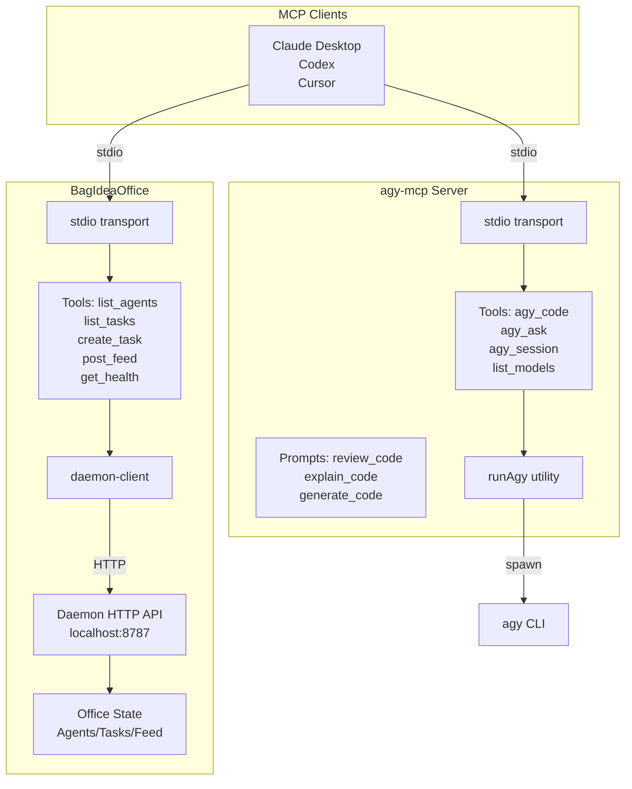
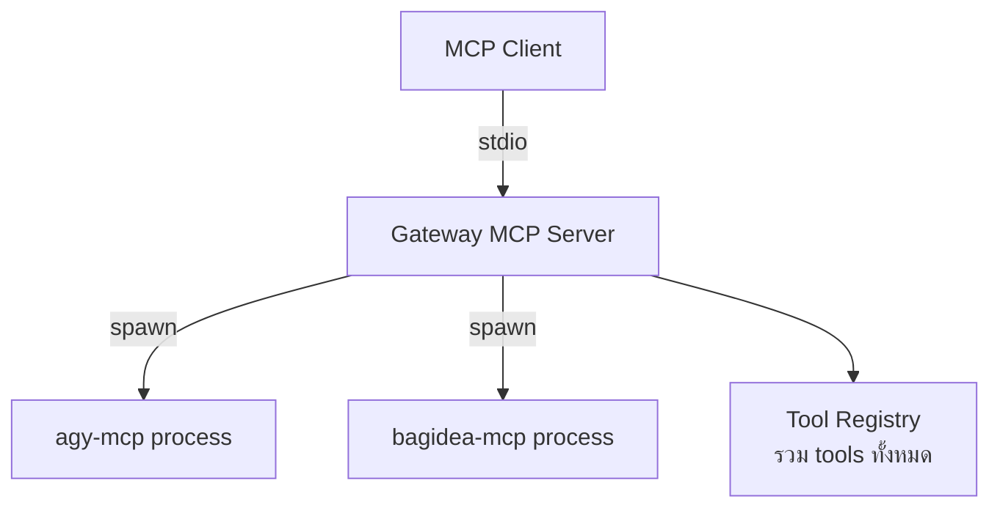
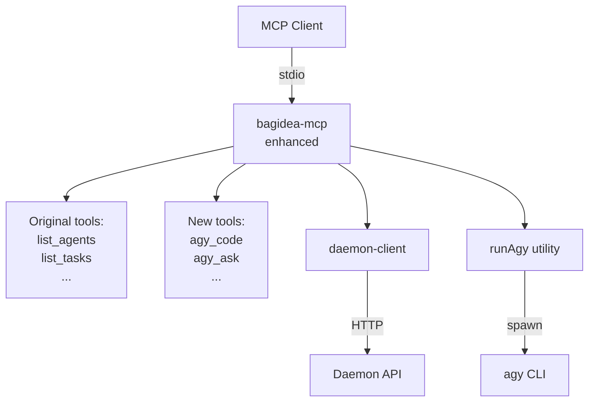
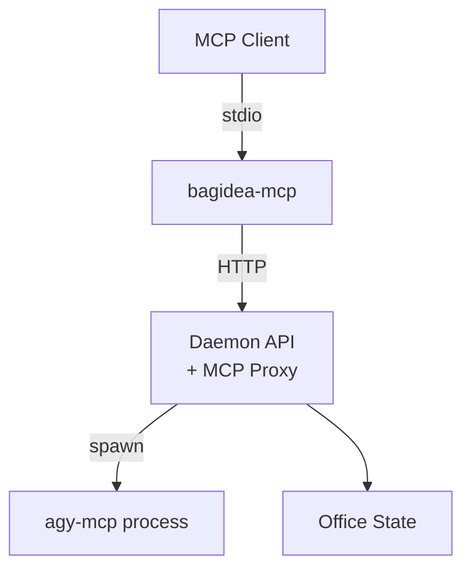
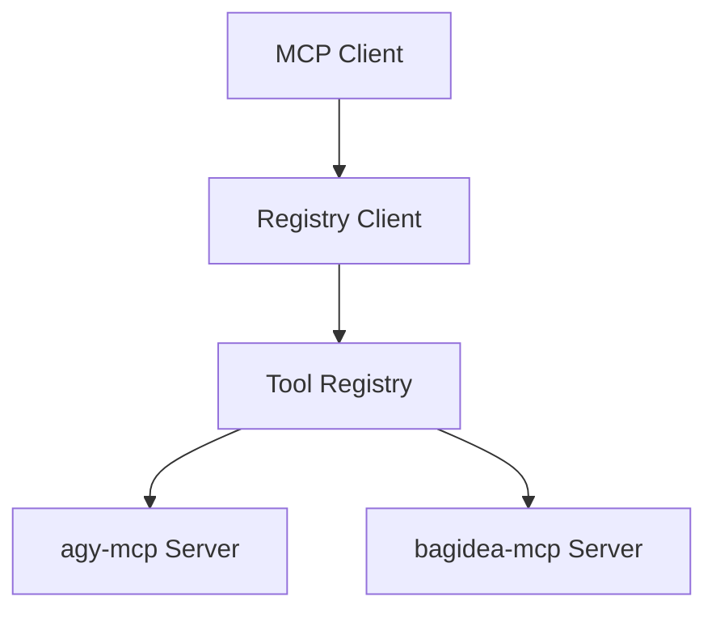

# Integration Analysis: agy-mcp + BagIdeaOffice

**Date:** 2026-06-23  
**Author:** Arthit (System Architect)  
**Status:** Draft Analysis

---

## Executive Summary

agy-mcp และ BagIdeaOffice เป็น MCP servers ที่ใช้ stdio transport เหมือนกัน แต่มี architecture ต่างกัน:

- **agy-mcp**: Wrap agy CLI โดยตรง (spawn process)
- **bagidea-mcp**: เรียก daemon HTTP API (localhost:8787)

เป้าหมาย: ทำให้ BagIdeaOffice สามารถเรียกใช้ agy-mcp tools ได้

---

## Current Architecture



---

## Integration Options

### Option 1: MCP Composition Gateway (แนะนำ ⭐)

สร้าง MCP server ใหม่ที่ทำหน้าที่เป็น gateway รวบรวม tools จากทั้งสอง servers

**Architecture:**


**Pros:**
- ✅ Clean separation — แต่ละ server ทำงานอิสระ
- ✅ Easy to add more MCP servers ในอนาคต
- ✅ No code changes ใน existing servers
- ✅ Client เห็น tools ทั้งหมดในที่เดียว

**Cons:**
- ❌ ต้องสร้าง gateway server ใหม่
- ❌ มี process overhead (3 processes แทน 1)
- ❌ ซับซ้อนในการ debug

**Implementation Effort:** Medium (2-3 days)

---

### Option 2: Extend bagidea-mcp with agy tools (ง่ายที่สุด ⚡)

เพิ่ม agy-mcp tools เข้าไปใน bagidea-mcp โดยตรง

**Architecture:**


**Pros:**
- ✅ ง่ายที่สุด — แค่ copy tools จาก agy-mcp มา
- ✅ Single process — no overhead
- ✅ ง่ายต่อการ debug
- ✅ Client ต่อที่เดียวได้ครบ

**Cons:**
- ❌ Code duplication (ถ้า agy-mcp อัพเดท ต้องแก้ที่เดียว)
- ❌ bagidea-mcp ใหญ่ขึ้น
- ❌ ผิดหลัก separation of concerns

**Implementation Effort:** Low (1 day)

---

### Option 3: Daemon-Side Integration

เพิ่ม endpoint ใน daemon เพื่อ proxy MCP requests ไปยัง agy-mcp

**Architecture:**


**Pros:**
- ✅ bagidea-mcp ยังเป็น thin wrapper
- ✅ ควบคุม access ผ่าน daemon ได้
- ✅ เพิ่ม security layer

**Cons:**
- ❌ ซับซ้อน — ต้อง implement MCP proxy ใน daemon
- ❌ Performance overhead (HTTP + stdio)
- ❌ Daemon ต้อง manage agy-mcp process lifecycle

**Implementation Effort:** High (3-5 days)

---

### Option 4: Hybrid Registry

สร้าง shared registry ที่ทั้งสอง servers ลงทะเบียน tools

**Architecture:**


**Pros:**
- ✅ Loose coupling
- ✅ Scalable — เพิ่ม servers ได้ง่าย

**Cons:**
- ❌ Over-engineering สำหรับ use case นี้
- ❌ ต้องสร้าง registry infrastructure
- ❌ Client ต้องต่อหลายที่

**Implementation Effort:** Very High (5+ days)

---

## Recommendation

### สำหรับ MVP: **Option 2 — Extend bagidea-mcp**

**เหตุผล:**
1. **เร็วที่สุด** — 1 วันเสร็จ
2. **ง่ายที่สุด** — แค่ import tools จาก agy-mcp
3. **ดีพอ** — สำหรับ internal use ในออฟฟิศ
4. **ปรับปรุงทีหลังได้** — ถ้าต้องการแยก ค่อย refactor เป็น Option 1

### สำหรับ Production: **Option 1 — MCP Composition Gateway**

**เหตุผล:**
1. **Clean architecture** — แยก concerns ชัดเจน
2. **Scalable** — เพิ่ม MCP servers ได้ง่าย
3. **Maintainable** — แต่ละ team ดูแล server ของตัวเอง

---

## Implementation Plan (Option 2 - MVP)

### Phase 1: Port agy-mcp tools (1 day)

1. **Copy utilities:**
   - `run_agy.ts` → `bagidea-mcp/src/utils/`
   - `session_store.ts` → `bagidea-mcp/src/utils/`
   - `sanitize_prompt.ts` → `bagidea-mcp/src/utils/`

2. **Copy tools:**
   - `agy_code.ts` → `bagidea-mcp/src/tools/`
   - `agy_ask.ts` → `bagidea-mcp/src/tools/`
   - `agy_session.ts` → `bagidea-mcp/src/tools/`
   - `list_models.ts` → `bagidea-mcp/src/tools/`

3. **Copy prompts:**
   - `review_code.ts` → `bagidea-mcp/src/prompts/`
   - `explain_code.ts` → `bagidea-mcp/src/prompts/`
   - `generate_code.ts` → `bagidea-mcp/src/prompts/`
   - `ask_expert.ts` → `bagidea-mcp/src/prompts/`

4. **Update index.ts:**
   - Import agy tools/prompts
   - Register ใน TOOLS array
   - เพิ่ม handlers ใน CallToolRequestSchema

5. **Test:**
   - Unit tests สำหรับแต่ละ tool
   - Integration test กับ daemon

### Phase 2: Configuration (0.5 day)

1. **Environment variables:**
   ```bash
   AGY_CLI_PATH=/path/to/agy  # optional, default: agy
   AGY_DEFAULT_MODEL=Claude Sonnet 4.6
   ```

2. **Config file (optional):**
   ```json
   {
     "agy": {
       "enabled": true,
       "defaultModel": "Claude Sonnet 4.6",
       "maxTokens": 8192
     }
   }
   ```

### Phase 3: Documentation (0.5 day)

1. Update README.md
2. เพิ่มตัวอย่าง usage
3. Troubleshooting guide

---

## Migration Path (Option 2 → Option 1)

ถ้าต้องการ refactor เป็น gateway ในอนาคต:

1. **Extract agy tools** ออกจาก bagidea-mcp
2. **สร้าง gateway server** ใหม่
3. **Update client config** ให้ชี้ไป gateway
4. **Deprecate** integrated version

**Effort:** 2-3 days

---

## Risk Assessment

### Option 2 Risks

| Risk | Probability | Impact | Mitigation |
|------|-------------|--------|------------|
| Code duplication | High | Medium | Document clearly, plan refactor |
| agy-mcp updates | Medium | Medium | Monitor agy-mcp repo, sync manually |
| bagidea-mcp too large | Low | Low | Refactor to Option 1 if needed |

### Option 1 Risks

| Risk | Probability | Impact | Mitigation |
|------|-------------|--------|------------|
| Process overhead | Medium | Low | Optimize spawn strategy |
| Debug complexity | Medium | Medium | Add comprehensive logging |
| Gateway bugs | Medium | High | Extensive testing |

---

## Decision Matrix

| Criteria | Weight | Option 1 | Option 2 | Option 3 | Option 4 |
|----------|--------|----------|----------|----------|----------|
| Implementation Speed | 30% | 6/10 | **10/10** | 4/10 | 2/10 |
| Code Quality | 25% | **9/10** | 6/10 | 7/10 | 8/10 |
| Maintainability | 20% | **9/10** | 5/10 | 7/10 | 9/10 |
| Scalability | 15% | **10/10** | 4/10 | 8/10 | 10/10 |
| Debuggability | 10% | 6/10 | **9/10** | 5/10 | 4/10 |
| **Total Score** | 100% | **7.95** | **6.85** | 5.95 | 6.25 |

**Winner:** Option 2 (MVP) → Option 1 (Production)

---

## Next Steps

1. **CEO Decision:** เลือก Option 2 (MVP) หรือ Option 1 (Production)?
2. **Assign Team:**
   - Option 2: Krit (1 day)
   - Option 1: Arthit + Krit (3 days)
3. **Timeline:**
   - Option 2: เสร็จวันนี้
   - Option 1: เสร็จใน 3 วัน

---

## Appendix: Tool Inventory

### agy-mcp Tools (4 tools)
- `agy_code` — Generate/modify code
- `agy_ask` — Q&A with AI
- `agy_session_start` — Start multi-turn session
- `agy_session_end` — End session
- `list_models` — List available models

### bagidea-mcp Tools (5 tools)
- `list_agents` — List office agents
- `list_tasks` — List tasks
- `create_task` — Create new task
- `post_feed` — Post to feed
- `get_health` — Check daemon health

### Combined (9 tools + 4 prompts)
- All agy-mcp tools
- All bagidea-mcp tools
- All agy-mcp prompts (review_code, explain_code, generate_code, ask_expert)

---

**Document Version:** 1.0  
**Last Updated:** 2026-06-23
